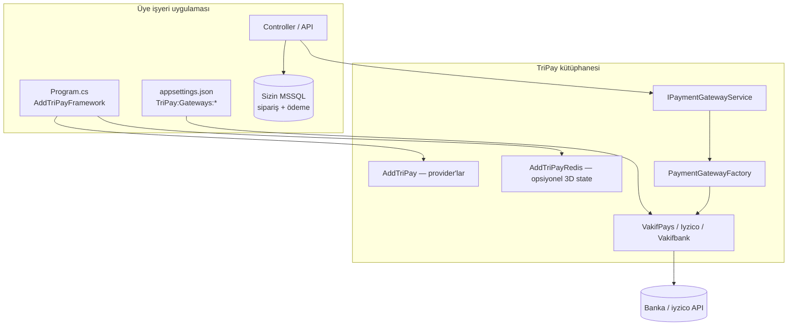

# TriPay — Framework Modu (`AddTriPayFramework`)

> **Program.cs:** [TriPay_Program_cs_ve_DI.md §4](./TriPay_Program_cs_ve_DI.md#4-aspnet-core-web--framework-önerilen)  
> API örnekleri: [TriPay_Kullanim_Kilavuzu.md](./TriPay_Kullanim_Kilavuzu.md)

**Versiyon:** 1.0 · **Tarih:** 22 Mayıs 2026

---

## `AddTriPayFramework` ≠ `AddTriPay`

Framework, `AddTriPay`’i içeride çağırır; ek olarak Redis ve `IGatewaySettingsProvider` ekler.  
Karşılaştırma: [TriPay_Program_cs_ve_DI.md §2](./TriPay_Program_cs_ve_DI.md#2-addtripay-vs-addtripayframework--karşılaştırma)

---

## Bu mod ne işe yarar?

Üye işyeri kendi ASP.NET Core uygulamasında TriPay kütüphanesini **in-process** çalıştırır. Bankaya giden HTTP çağrıları TriPay provider’ları üzerinden gider; **TriPay MSSQL veritabanı kullanılmaz**, **işlem ve ham API logları TriPay tarafında saklanmaz**.

| Özellik | Değer |
| :--- | :--- |
| **DI girişi** | `AddTriPayFramework(configuration)` |
| **Ana API** | `IPaymentGatewayService` |
| **TriPay MSSQL** | Hayır |
| `TransactionLogs` | Hayır |
| `IPaymentCheckoutService` | Hayır |
| **Banka config** | Sizin `appsettings` / Key Vault |
| **KVKK (TriPay tarafı)** | Minimal risk |

---

## Ne zaman seçilir?

- E-ticaret / API projesi kendi sipariş ve ödeme tablolarına sahip
- “Hiçbir kişisel veri TriPay sunucusunda kalmasın” hedefi
- NuGet veya DLL ile doğrudan kütüphane referansı
- Hosted checkout veya TriPay operatör DB’si **istenmiyor**

**Seçilmez:** TriPay’in merkezi işlem paneli, `TransactionLogs` incelemesi, outbox webhook operasyonu gerekiyorsa → [TriPay_Hosted_Modu.md](./TriPay_Hosted_Modu.md).

---

## Mimari diyagram



---

## Kurulum

### NuGet / proje referansı

```bash
dotnet add package TriPay
# veya monorepo:
# dotnet add reference ../tripay/TriPay.Services/TriPay.Services.csproj
# dotnet add reference ../tripay/TriPay.Persistence/TriPay.Persistence.csproj
```

`AddTriPayFramework` extension metodu **`TriPay.Persistence`** projesindedir (NuGet paketinde Persistence DLL’si ile birlikte gelir veya ayrı referans gerekir).

### Program.cs

Tam örnek (Web + Console): [**TriPay_Program_cs_ve_DI.md**](./TriPay_Program_cs_ve_DI.md).

Framework modunda **çağırmayın:** `AddTriPayHosted`, `AddTriPayData`, yalnız `AddTriPay()`.

---

## appsettings.json (Framework)

```json
{
  "ConnectionStrings": {
    "Redis": "localhost:6379"
  },
  "TriPay": {
    "Persistence": {
      "Enabled": false,
      "PersistTransactionLogs": false,
      "EnableOutbox": false
    },
    "DefaultGateway": "VakifPays",
    "Redis": {
      "Enabled": true,
      "Configuration": "localhost:6379"
    },
    "Gateways": {
      "VakifPays": {
        "Enabled": true,
        "IsTestMode": true,
        "Settings": {
          "Merchant": "10009011",
          "MerchantUser": "apitest48@vakifpays.com.tr",
          "MerchantPassword": "Api.123.1234"
        }
      },
      "Iyzico": {
        "Enabled": true,
        "IsTestMode": true,
        "Settings": {
          "ApiKey": "sizin-api-key",
          "SecretKey": "sizin-secret"
        }
      },
      "Vakifbank": {
        "Enabled": true,
        "IsTestMode": true,
        "Settings": {
          "MerchantId": "sizin-merchant-id",
          "MerchantPassword": "sizin-sifre",
          "TerminalNo": "sizin-terminal"
        }
      }
    }
  }
}
```

| Alan | Açıklama |
| :--- | :--- |
| `Persistence.Enabled` | `false` — checkout servisi DI’a eklenmez |
| `Gateways:*:Settings` | **Sizin** banka credential’larınız |
| `Redis:Enabled` | Vakıfbank 3D state için önerilir; kapalıysa bellek içi fallback |

---

## `AddTriPayFramework` içinde ne kayıt olur?

| Kayıt | Açıklama |
| :--- | :--- |
| `AddTriPay()` | `VakifPays`, `Iyzico`, `Vakifbank` provider + `IPaymentGatewayService` |
| `AddTriPayRedis()` | Redis veya InMemory cache, idempotency, kilit, rate limit |
| `ConfigurationGatewaySettingsProvider` | Gateway ayarları yalnızca `appsettings` |
| `IGatewaySettingsProvider` | Yukarıdaki provider (DB metadata **yok**) |
| `TriPayPersistenceOptions` | Zorla `Enabled=false`, log/outbox kapalı |

---

## Kod örneği — ödeme başlatma

```csharp
using TriPay.Services;
using TriPay.Services.Interfaces;
using TriPay.Services.Models;
using TriPay.Services.Providers.VakifPays.Models;

public class PaymentController : Controller
{
    private readonly IPaymentGatewayService _payment;

    public PaymentController(IPaymentGatewayService payment) => _payment = payment;

    [HttpPost("pay")]
    public async Task<IActionResult> Pay(PaymentRequest model, CancellationToken ct)
    {
        var result = await _payment.InitializePaymentAsync(
            new PaymentGatewayInitializeRequestDto
            {
                GatewayName = PaymentGatewayNames.VakifPays,
                Payment = model
            },
            PaymentGatewayNames.VakifPays,
            ct);

        if (!result.IsSuccess)
            return BadRequest(result.ErrorMessage);

        // Sonucu KENDİ veritabanınıza siz yazın
        // await _orderRepository.SavePendingAsync(model.OrderNumber, ...);

        if (!string.IsNullOrEmpty(result.Data?.RedirectHtml))
            return Content(result.Data.RedirectHtml, "text/html");

        return Ok(result.Data);
    }
}
```

---

## Callback ve 3D

Framework modunda callback işleme yine `IPaymentGatewayService` üzerinden yapılır; TriPay otomatik `TransactionLogs` yazmaz.

```csharp
var callback = await _payment.ProcessCallbackAsync(new PaymentGatewayCallbackRequestDto
{
    GatewayName = PaymentGatewayNames.Vakifbank,
    RawData = formFields
}, PaymentGatewayNames.Vakifbank);
```

Vakıfbank 3D sonrası tam tahsilat için `Auth3DSAsync` kullanın (Redis sale state gerekir).

---

## Veri sorumluluğu (KVKK)

| Veri | Nerede? |
| :--- | :--- |
| Kart (PAN/CVV) | Yalnızca bankaya giden istekte; TriPay DB’ye **yazılmaz** |
| Sipariş / müşteri | **Sizin** veritabanınız |
| Ham banka request/response | TriPay’de **saklanmaz** (`TransactionLogs` yok) |
| Redis 3D state | Geçici, TTL ile silinir; kişisel veri minimum |

---

## Sık yapılan hatalar

| Hata | Doğrusu |
| :--- | :--- |
| `AddTriPayHosted` + Framework sanmak | Hosted = MSSQL; Framework = `AddTriPayFramework` |
| `IPaymentCheckoutService` enjekte etmek | Framework’te kayıtlı değil; `IPaymentGatewayService` kullanın |
| Credential’ları TriPay DB’ye koymak | `appsettings` / Vault |
| `AddTriPayData` çağırmak | Framework’te gerek yok |

---

## İlgili dokümanlar

| Doküman | Konu |
| :--- | :--- |
| [TriPay_Hosted_Modu.md](./TriPay_Hosted_Modu.md) | MSSQL + Checkout + log |
| [TriPay_AddTriPay_Dusuk_Seviye.md](./TriPay_AddTriPay_Dusuk_Seviye.md) | `AddTriPay()` — test / iç yapı |
| [TriPay_Program_cs_ve_DI.md](./TriPay_Program_cs_ve_DI.md) | Program.cs tek kaynak |
| [TriPay_Kullanim_Kilavuzu.md](./TriPay_Kullanim_Kilavuzu.md) | Tüm API örnekleri A–Z |

---

**Hazırlayan:** TriPay Geliştirme Ekibi
