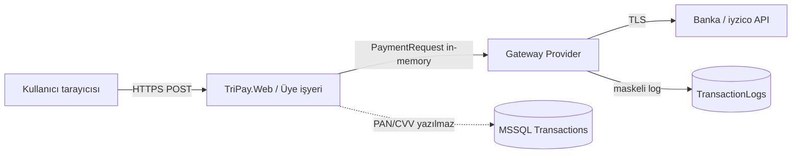
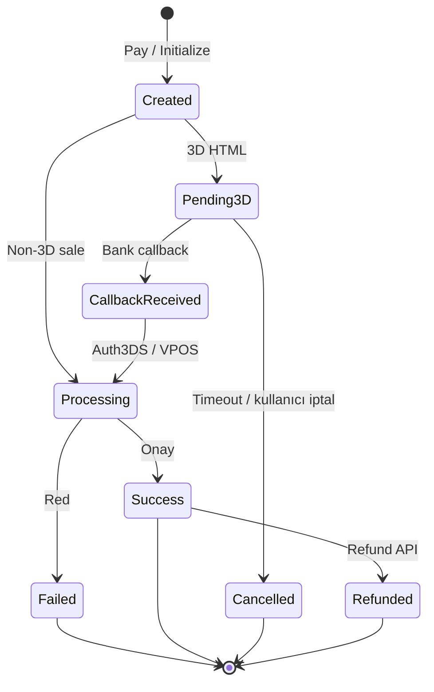
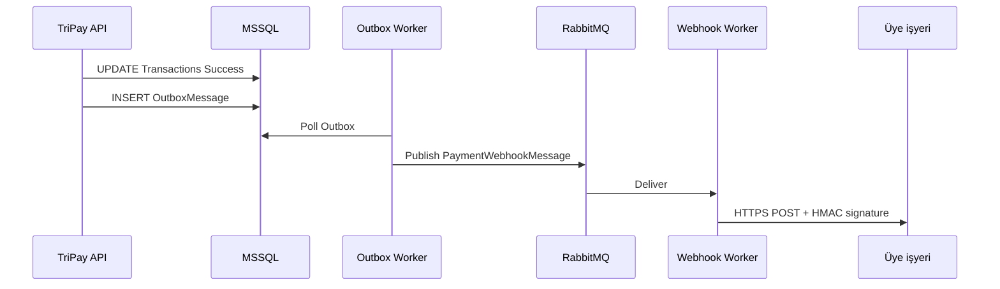
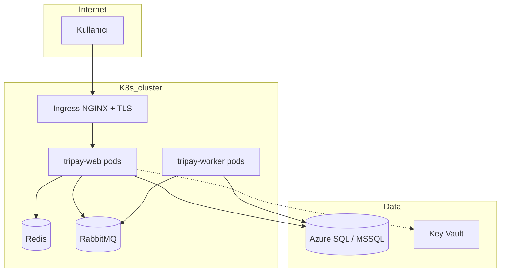

> **Dosya Adı:** `TriPay_Guvenlik_ve_Altrapi_Dokumani.md`  
> **Bağlayıcı güvenlik ve altyapı kaynağı** — İşlem yönetimi, idempotency, RabbitMQ, Redis, Docker, Kubernetes.  
> Ana doküman: [TriPay_Proje_Dokumani.md](./TriPay_Proje_Dokumani.md) · Entegrasyon: [TriPay_Kullanim_Kilavuzu.md](./TriPay_Kullanim_Kilavuzu.md)

# TriPay — Güvenlik, İşlem Yönetimi ve Altyapı (v1.0)

| Alan | Değer |
| :--- | :--- |
| **Versiyon** | 1.0 |
| **Tarih** | 22 Mayıs 2026 |
| **Kapsam** | PCI-DSS, transaction engine, Redis, RabbitMQ, MSSQL, Docker, Kubernetes |
| **Durum** | Altyapı iskeleti repo’da; tam `TriPay.Data` + MassTransit Faz 1.1 |

---

## Zorunlu kural

**Güvenlik ve ödeme işlemi ile ilgili kod veya deployment değişikliği yapılmadan önce bu doküman okunur.** Ana dokümandaki §8 (webhook), §9 (DB), §10 (PCI) ile çelişen tasarım **yasaktır**.

---

## İçindekiler

1. [Güvenlik prensipleri](#1-güvenlik-prensipleri)
2. [Tehdit modeli](#2-tehdit-modeli)
3. [İşlem yaşam döngüsü (state machine)](#3-işlem-yaşam-döngüsü-state-machine)
4. [Idempotency ve çift tahsilat önleme](#4-idempotency-ve-çift-tahsilat-önleme)
5. [Redis — ne zaman, ne için](#5-redis--ne-zaman-ne-için)
6. [RabbitMQ — kuyruk mimarisi](#6-rabbitmq--kuyruk-mimarisi)
7. [MSSQL ve ACID işlem sınırları](#7-mssql-ve-acid-işlem-sınırları)
8. [Webhook güvenliği](#8-webhook-güvenliği)
9. [Gizli bilgiler (secrets)](#9-gizli-bilgiler-secrets)
10. [Docker (geliştirme ve CI)](#10-docker-geliştirme-ve-ci)
11. [Kubernetes (üretim)](#11-kubernetes-üretim)
12. [Gözlemlenebilirlik ve denetim](#12-gözlemlenebilirlik-ve-denetim)
13. [Mevcut kod ↔ hedef eşlemesi](#13-mevcut-kod--hedef-eşlemesi)
14. [Uygulama fazları](#14-uygulama-fazları)

---

## 1. Güvenlik prensipleri

| Prensip | TriPay uygulaması |
| :--- | :--- |
| **Defense in depth** | WAF/Ingress TLS + uygulama doğrulama + DB şifreleme + ağ politikası |
| **En az ayrıcalık** | K8s ServiceAccount, DB kullanıcıları salt okunur/ yazma ayrımı |
| **PCI-DSS scope daraltma** | PAN/CVV **asla** MSSQL veya log’a ham yazılmaz; maskeli log |
| **Fail closed** | Callback imzası / tutar doğrulaması / idempotency başarısız → işlem **onaylanmaz** |
| **Deterministik işlem** | Her `OrderNumber` + `MerchantId` için tek `Transactions` satırı; durum geçişleri kontrollü |
| **Asenkron güvenilirlik** | Webhook ve yan etkiler RabbitMQ + DLQ; senkron yol yalnızca banka cevabı |

**Kart verisi akışı (hedef):**



---

## 2. Tehdit modeli

| Tehdit | Risk | Önlem |
| :--- | :---: | :--- |
| Callback replay (aynı POST tekrar) | Kritik | Redis idempotency + `Transactions.Status` terminal kontrolü |
| Tutar manipülasyonu | Kritik | `PendingPayment` / DB `Amount` ile callback tutarı karşılaştırma |
| Sahte callback (MITM) | Yüksek | Banka alan doğrulama + Auth3DS + durum sorgusu; Vakıfbank ECI/CAVV |
| PAN sızıntısı (log/DB) | Kritik | `PciDataMasker`, §9.3 maskeli payload |
| API key sızıntısı | Yüksek | K8s Secret / Key Vault; `appsettings` prod’da boş |
| RabbitMQ mesaj sniffing | Orta | TLS (`amqps`), ayrı namespace, NetworkPolicy |
| Redis key enumeration | Orta | Auth + TLS (prod), key prefix `tripay:` |
| Pod compromise | Yüksek | Non-root container, read-only root FS, secret mount |

---

## 3. İşlem yaşam döngüsü (state machine)

Kalıcı durum **MSSQL `Transactions.Status`** alanında tutulur. Geçici 3D verisi **Redis**’te (`VakifbankSaleState`) tutulur; bu bir işlem durumu değil, **oturum artefaktı**dır.

### 3.1. Durumlar (`PaymentTransactionStatus`)

| Durum | Açıklama | Terminal? |
| :--- | :--- | :---: |
| `Created` | Kayıt açıldı, henüz bankaya gitmedi | Hayır |
| `Pending3D` | 3D HTML döndü, kullanıcı ACS’de | Hayır |
| `CallbackReceived` | Banka callback alındı, Auth3DS bekliyor olabilir | Hayır |
| `Processing` | VPOS / Auth3DS devam ediyor | Hayır |
| `Success` | Tahsilat onaylandı | **Evet** |
| `Failed` | Red / hata | **Evet** |
| `Cancelled` | Kullanıcı veya süre aşımı iptali | **Evet** |
| `Refunded` | İade tamamlandı (kısmi/tam) | **Evet** |

### 3.2. Geçiş diyagramı



### 3.3. Kurallar

1. `Success` veya `Refunded` durumundaki işlem **yeniden tahsil edilemez** (idempotency + DB unique constraint).
2. Callback işlenirken durum `Processing`’e alınır; yarış durumunda **optimistic concurrency** (`RowVersion`) kullanılır.
3. Her geçiş `TransactionLogs` satırı üretir (`LogType` = `CallbackRequest` vb.).
4. Üye işyeri webhook’u yalnızca **terminal** durumlarda (`Success` / `Failed`) kuyruğa atılır.

---

## 4. Idempotency ve çift tahsilat önleme

### 4.1. Idempotency anahtarı

| Adım | Anahtar formatı | TTL |
| :--- | :--- | :--- |
| Callback | `idempotency:callback:{gateway}:{paymentId}:{status}` | 7 gün |
| Auth3DS | `idempotency:auth3ds:{gateway}:{paymentId}` | 7 gün |
| Initialize (opsiyonel) | `idempotency:init:{merchantId}:{orderNumber}` | 24 saat |

Üretim: `TriPay.Services/Idempotency/IdempotencyKeyBuilder.cs`  
Depolama: `RedisIdempotencyStore` (`IDistributedCache`)

### 4.2. Davranış

1. İstek gelir → Redis’te sonuç var mı?
2. Varsa **aynı `Result<T>`** döndürülür (bankaya tekrar gitmez).
3. Yoksa provider çalışır; başarılı/terminal cevap Redis’e yazılır.
4. MSSQL geldiğinde aynı anahtar `Transactions.IdempotencyKey` (unique) ile çift kayıt engellenir.

### 4.3. Demo `CheckoutController` uyarısı

`ConcurrentDictionary PendingPayments` **yalnızca demo** içindir; üretimde:

- Tutar doğrulaması → `Transactions.Amount`
- Oturum → Redis veya DB
- Idempotency → `PaymentGatewayService` + Redis

---

## 5. Redis — ne zaman, ne için

| Kullanım | Key örneği | TTL | Açıklama |
| :--- | :--- | :--- | :--- |
| Vakıfbank 3D satış durumu | `tripay:vakifbank:sale:{orderCode}` | 24 saat | CVV, tutar, IP — **Auth3DS için** |
| Idempotency | `tripay:idempotency:...` | 7 gün | Callback replay koruması |
| Distributed lock (ileri) | `tripay:lock:txn:{id}` | 30 sn | Aynı işlemde paralel callback engeli |
| Rate limit (ileri) | `tripay:rl:{merchantId}` | 1 dk | API abuse |

**Prod zorunlulukları:** şifre (`requirepass` veya ACL), TLS, ayrı Redis instance (ödeme trafiği ≠ genel cache).

Yapılandırma: `TriPay:Redis` — [appsettings örneği](../TriPay/appsettings.json)

---

## 6. RabbitMQ — kuyruk mimarisi

RabbitMQ **senkron ödeme yoluna girmez**; yalnızca **yan etkiler** ve **güvenilir teslimat** için kullanılır.

### 6.1. Exchange ve kuyruklar

| Exchange | Tip | Kuyruk | Routing key | Tüketici |
| :--- | :--- | :--- | :--- | :--- |
| `tripay.events` | topic | `tripay.webhook.dispatch` | `webhook.merchant.{merchantId}` | Webhook Worker |
| `tripay.events` | topic | `tripay.transaction.audit` | `txn.log.persist` | Log Worker (opsiyonel) |
| `tripay.dlx` | fanout | `tripay.webhook.dlq` | — | Operasyon / alarm |

### 6.2. Mesaj sözleşmesi

`PaymentWebhookMessage` (JSON):

| Alan | Tip | Açıklama |
| :--- | :--- | :--- |
| `MessageId` | GUID | Tekil mesaj |
| `TransactionId` | int | MSSQL FK |
| `MerchantId` | int | Üye işyeri |
| `OrderNumber` | string | Sipariş no |
| `Status` | string | `Success` / `Failed` |
| `Amount` | decimal | Tutar |
| `Currency` | string | TRY |
| `OccurredAtUtc` | datetime | Olay zamanı |
| `Attempt` | int | Retry sayacı |

### 6.3. Retry ve DLQ

| Parametre | Değer |
| :--- | :--- |
| İlk retry gecikmesi | 30 sn |
| Maksimum retry | 5 |
| Backoff | Üstel (30s, 2m, 10m, 30m, 2h) |
| DLQ | `tripay.webhook.dlq` — manuel müdahale |

### 6.4. Publisher garantisi

1. Önce MSSQL’de `Transactions` → `Success` commit.
2. Sonra `Outbox` tablosuna mesaj yaz (transactional outbox pattern).
3. Arka plan worker Outbox → RabbitMQ publish.
4. Bu sayede **DB commit olmadan webhook gitmez**.



### 6.5. Geliştirme ortamı

`docker-compose.yml` içinde `rabbitmq:3-management` — yönetim UI: `http://localhost:15672` (guest/guest yalnızca local).

Yapılandırma: `TriPay:RabbitMq` — [appsettings](../TriPay/appsettings.json)

---

## 7. MSSQL ve ACID işlem sınırları

### 7.1. Unit of Work

Tek kullanıcı ödeme akışında **tek transaction** içinde:

```csharp
await using var tx = await _db.Database.BeginTransactionAsync();
// 1. Transactions INSERT/UPDATE
// 2. TransactionLogs INSERT
// 3. OutboxMessages INSERT (webhook)
await tx.CommitAsync();
```

### 7.2. Unique kısıtlar

| Kısıt | Amaç |
| :--- | :--- |
| `UQ_Transactions_Merchant_Order` | Aynı siparişe çift ödeme kaydı yok |
| `UQ_Transactions_IdempotencyKey` | Replay koruması |

### 7.3. Always Encrypted

`MerchantGateways.EncryptedCredentials` — API anahtarları uygulama katmanında şifrelenir, DBA okuyamaz.

---

## 8. Webhook güvenliği

Üye işyerine giden bildirimler (TriPay → merchant):

| Header | Değer |
| :--- | :--- |
| `X-TriPay-Signature` | `Base64(HMAC-SHA256(body + timestamp, WebhookSecret))` |
| `X-TriPay-Timestamp` | Unix epoch |
| `X-TriPay-Event` | `payment.success` / `payment.failed` |

Implementasyon: `TriPay.Services/Security/WebhookSignatureHelper.cs`  
Doğrulama örneği: ana doküman §8.

**Saat penceresi:** timestamp ± 5 dakika (replay).

---

## 9. Gizli bilgiler (secrets)

| Ortam | Yöntem |
| :--- | :--- |
| Local dev | User Secrets (`dotnet user-secrets`) — repo’ya yazılmaz |
| Docker Compose | `.env` (gitignore) → env var |
| Kubernetes | `Secret` + External Secrets Operator → Azure Key Vault |
| CI/CD | GitHub Actions encrypted secrets |

**Asla commit edilmeyecekler:** `MerchantPassword`, `SecretKey`, `WebhookSecret`, Redis/RabbitMQ şifreleri.

Örnek K8s: [deploy/kubernetes/secret.yaml.example](../deploy/kubernetes/secret.yaml.example)

---

## 10. Docker (geliştirme ve CI)

### 10.1. docker-compose (repo kökü)

```bash
docker compose up -d
```

Servisler:

| Servis | Port | Açıklama |
| :--- | :--- | :--- |
| `redis` | 6379 | 3D state + idempotency |
| `rabbitmq` | 5672, 15672 | Kuyruk + management UI |
| `mssql` | 1433 | Geliştirme DB (sa şifresi compose env) |

### 10.2. Uygulama imajı

`deploy/docker/Dockerfile` — çok aşamalı build, non-root kullanıcı.

```bash
docker build -f deploy/docker/Dockerfile -t tripay/web:dev .
```

---

## 11. Kubernetes (üretim)

Manifestler: `deploy/kubernetes/`

| Dosya | Amaç |
| :--- | :--- |
| `namespace.yaml` | `tripay` izolasyonu |
| `configmap.yaml` | Gateway enable bayrakları (secret değil) |
| `secret.yaml.example` | Secret şablonu — gerçek değerler Vault’tan |
| `redis.yaml` | Redis StatefulSet veya managed Redis referansı |
| `rabbitmq.yaml` | Cluster veya managed AMQP referansı |
| `tripay-web-deployment.yaml` | MVC/API deployment |
| `ingress.yaml` | TLS termination (cert-manager) |
| `network-policy.yaml` | Pod’lar arası minimum trafik |

### 11.1. Önerilen topoloji



### 11.2. Sağlık ve ölçekleme

| Probe | Yol |
| :--- | :--- |
| Liveness | `/health/live` |
| Readiness | `/health/ready` (Redis + MSSQL + RabbitMQ ping) |

HPA: CPU %70, min 2 max 10 replica (web).

### 11.3. NetworkPolicy özeti

- `tripay-web`: ingress’ten 443; egress → Redis, MSSQL, RabbitMQ, banka API HTTPS (443)
- `tripay-worker`: ingress yok; egress → RabbitMQ, MSSQL, merchant webhook HTTPS

---

## 12. Gözlemlenebilirlik ve denetim

| Bileşen | Araç |
| :--- | :--- |
| Uygulama log | Serilog → MSSQL `TransactionLogs` + stdout (Loki) |
| Metrik | Prometheus (işlem sayısı, başarı oranı, callback latency) |
| İz | OpenTelemetry → banka çağrı süreleri |
| Alarm | DLQ depth > 0, başarı oranı <%95, Redis down |

**Audit:** `TransactionLogs` silinmez; yalnızca arşiv job (90 gün sonra cold storage).

---

## 13. Mevcut kod ↔ hedef eşlemesi

| Hedef | Mevcut | Dosya / not |
| :--- | :--- | :--- |
| Idempotency | ✅ Redis store | `RedisIdempotencyStore`, `PaymentGatewayService` |
| 3D Redis state | ✅ | `RedisVakifbankSaleStateStore` |
| Transaction DB | ❌ | `TriPay.Data` planlı §9 |
| RabbitMQ publisher | ❌ | `PaymentWebhookMessage` sözleşmesi hazır |
| Outbox pattern | ❌ | Faz 1.1 |
| Webhook HMAC | ✅ helper | `WebhookSignatureHelper` |
| PCI mask | ✅ helper | `PciDataMasker` |
| docker-compose | ✅ | `docker-compose.yml` |
| K8s manifests | ✅ iskelet | `deploy/kubernetes/` |
| Demo PendingPayments | ⚠️ | `CheckoutController` — prod’da kaldırılacak |

---

## 14. Uygulama fazları

| Faz | İş | Öncelik |
| :---: | :--- | :---: |
| **1.0** | Bu doküman + compose + K8s iskelet + idempotency + security helpers | ✅ |
| **1.1** | `TriPay.Data` + `Transactions` / `TransactionLogs` + state geçişleri | Yüksek |
| **1.2** | MassTransit + RabbitMQ + Outbox + Webhook Worker | Yüksek |
| **1.3** | Health checks, Serilog MSSQL sink, Key Vault | Orta |
| **2.0** | NetworkPolicy prod, Redis TLS, mTLS banka çıkışı | Orta |

---

*Bu doküman `TriPay_Proje_Dokumani.md` ile birlikte okunur; çelişki durumunda önce ana doküman güncellenir.*
