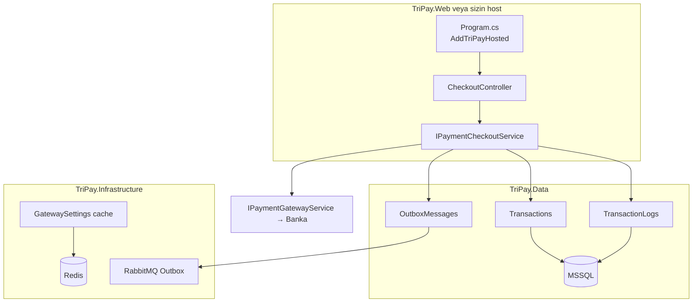
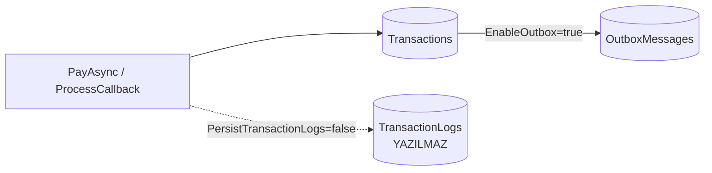

# TriPay — Hosted Modu (`AddTriPayHosted`)

> **Program.cs:** [TriPay_Program_cs_ve_DI.md §5](./TriPay_Program_cs_ve_DI.md#5-aspnet-core-web--hosted-demo--operatör)  
> DB tabloları: [TriPay_Admin_ve_Veritabani.md](./TriPay_Admin_ve_Veritabani.md)

**Versiyon:** 1.0 · **Tarih:** 22 Mayıs 2026

Bu doküman **Hosted** kullanımını anlatır: tam log profili (**Mod C**) ve KVKK hafif profil (**Mod C‑Lite**). İkisi de aynı DI girişini kullanır: `AddTriPayHosted()`.

---

# Bölüm 1 — Hosted Tam (Mod C)

## Özet

| Özellik | Değer |
| :--- | :--- |
| **DI girişi** | `AddTriPayHosted(configuration)` |
| **Ana API** | `IPaymentCheckoutService` (+ altta `IPaymentGatewayService`) |
| **TriPay MSSQL** | Evet |
| **`Transactions`** | Evet — işlem özeti |
| **`TransactionLogs`** | Evet — maskeli ham API log (`PersistTransactionLogs: true`) |
| **`OutboxMessages`** | Evet — webhook kuyruğu (`EnableOutbox: true`) |
| Gateway metadata | `GatewaySettings` + Redis cache (Infrastructure) |

---

## Mimari diyagram — Hosted Tam



---

## Kurulum — Hosted Tam

**Program.cs ve iç extension sırası:** [TriPay_Program_cs_ve_DI.md](./TriPay_Program_cs_ve_DI.md). Canlı örnek: `TriPay/Program.cs`.

### appsettings — Hosted Tam

```json
{
  "ConnectionStrings": {
    "TriPay": "Server=localhost,1433;Database=TriPay;User Id=sa;Password=***;TrustServerCertificate=True",
    "Redis": "localhost:6379"
  },
  "TriPay": {
    "Persistence": {
      "Enabled": true,
      "PersistTransactionLogs": true,
      "EnableOutbox": true
    },
    "Database": {
      "UseInMemory": false
    },
    "Redis": {
      "Enabled": true
    },
    "RabbitMq": {
      "Enabled": true,
      "HostName": "localhost"
    },
    "Gateways": {
      "VakifPays": {
        "Enabled": true,
        "IsTestMode": true,
        "Settings": {
          "Merchant": "",
          "MerchantUser": "",
          "MerchantPassword": ""
        }
      }
    }
  }
}
```

---

## Veritabanında ne tutulur? (Hosted Tam)

### `Transactions` — işlem özeti

Her ödeme denemesi için **tek satır**: sipariş no, tutar, durum (`Pending` / `Success` / `Failed`), banka işlem id, normalize sonuç kodu.

**İçermez:** Ham request/response gövdesi, kart numarası.

### `TransactionLogs` — normal log alanı (maskeli)

Her API adımı için ayrı satır (`PayRequest`, `InitializeRequest`, `InitializeResponse`, `CallbackRequest`, …).

| Kolon | İçerik |
| :--- | :--- |
| `RequestPayload` / `ResponsePayload` | **PCI maskeli** JSON veya form |
| `LogType` | Adım tipi |
| `DurationMs` | Süre |
| `ErrorCode` / `ErrorMessage` | Hata detayı |

Bu tablo operasyon ve destek için değerlidir; KVKK için saklama süresi ve erişim politikası tanımlanmalıdır.

Detaylı tablo listesi: [TriPay_Admin_ve_Veritabani.md](./TriPay_Admin_ve_Veritabani.md).

---

## Kod örneği — Checkout

```csharp
using TriPay.Services.Checkout;
using TriPay.Services.Providers.VakifPays.Models;

public class CheckoutController : Controller
{
    private readonly IPaymentCheckoutService _checkout;

    public CheckoutController(IPaymentCheckoutService checkout) => _checkout = checkout;

    [HttpPost]
    public async Task<IActionResult> Pay(PaymentRequest model)
    {
        var result = await _checkout.PayAsync(model, PaymentGatewayNames.VakifPays);
        if (!result.IsSuccess)
            return BadRequest(result.ErrorMessage);

        // DB'ye Transactions + TransactionLogs otomatik yazıldı
        if (!string.IsNullOrEmpty(result.Data?.RedirectHtml))
            return Content(result.Data.RedirectHtml, "text/html");

        return Ok(result.Data);
    }

    [HttpPost("callback")]
    public async Task<IActionResult> Callback()
    {
        var raw = Request.Form.ToDictionary(x => x.Key, x => x.Value.ToString() ?? "");
        var outcome = await _checkout.ProcessCallbackAsync(raw, PaymentGatewayNames.VakifPays);
        return Content(outcome.Message);
    }
}
```

---

# Bölüm 2 — Hosted C‑Lite (KVKK hafif profil)

## Özet

| Özellik | Hosted Tam | **Hosted C‑Lite** |
| :--- | :---: | :---: |
| DI | `AddTriPayHosted` | `AddTriPayHosted` (aynı) |
| `Transactions` | Evet | Evet |
| **`TransactionLogs`** | Evet | **Hayır** |
| `OutboxMessages` | Evet | Evet (isteğe bağlı) |
| KVKK riski | Orta | **Düşük** |

C‑Lite: TriPay işlem **özetini** tutar; banka ham logunu **yazmaz**.

---

## Mimari diyagram — C‑Lite



---

## appsettings — Hosted C‑Lite

`AddTriPayHosted` aynı; yalnızca persistence bayrakları değişir:

```json
{
  "TriPay": {
    "Persistence": {
      "Enabled": true,
      "PersistTransactionLogs": false,
      "EnableOutbox": true
    }
  }
}
```

| Bayrak | C‑Lite değeri | Etki |
| :--- | :--- | :--- |
| `Enabled` | `true` | `IPaymentCheckoutService` aktif |
| `PersistTransactionLogs` | **`false`** | `PaymentTransactionRepository.AddLogAsync` no-op |
| `EnableOutbox` | `true` / `false` | Webhook kuyruğu |

---

## Ne zaman C‑Lite?

- Hosted checkout veya tutar doğrulaması **gerekli**
- Ham banka logu **istenmiyor** (KVKK / sözleşme)
- İşlem özeti ve webhook **yeterli**

Tam operasyonel debug gerekiyorsa → **Hosted Tam** (`PersistTransactionLogs: true`).

---

# Karşılaştırma tablosu

| | Framework | Hosted Tam | Hosted C‑Lite |
| :--- | :---: | :---: | :---: |
| `AddTriPayFramework` | ✅ | ❌ | ❌ |
| `AddTriPayHosted` | ❌ | ✅ | ✅ |
| MSSQL | ❌ | ✅ | ✅ |
| `TransactionLogs` | ❌ | ✅ | ❌ |
| `IPaymentCheckoutService` | ❌ | ✅ | ✅ |
| Önerilen kullanıcı | Üye işyeri | TriPay operatörü | TriPay operatörü (KVKK) |

---

## Docker / yerel altyapı

```bash
docker compose up -d   # MSSQL + Redis + RabbitMQ
dotnet run --project TriPay
```

---

**Hazırlayan:** TriPay Geliştirme Ekibi
