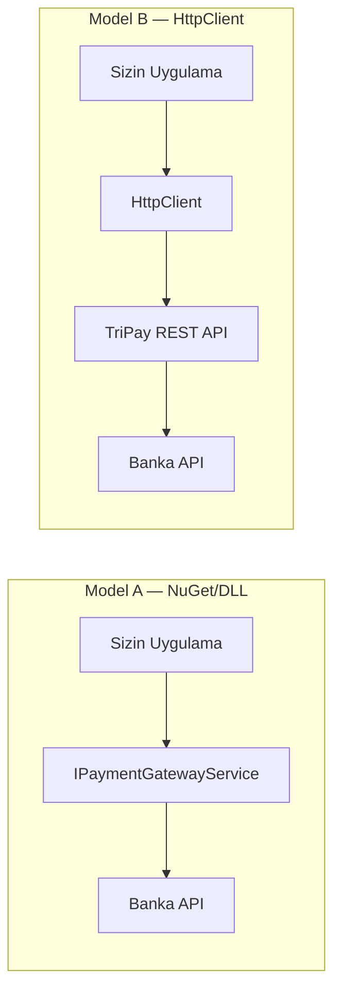
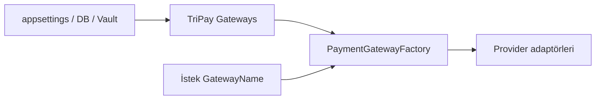
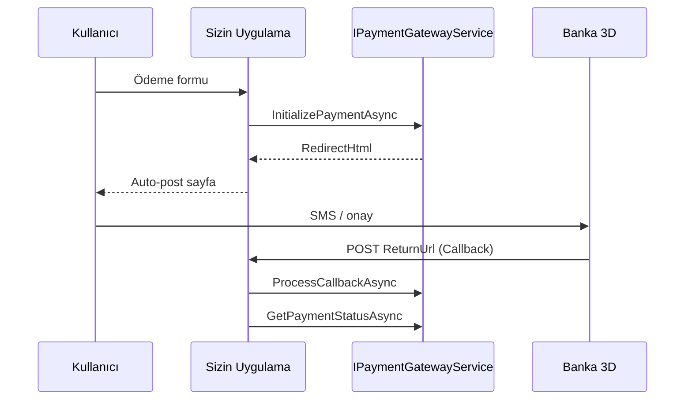

> **Dosya Adı:** `TriPay_Kullanim_Kilavuzu.md`  
> **İlişkili:** [TriPay_Proje_Dokumani.md](./TriPay_Proje_Dokumani.md) (mimari ve kurallar)

# TriPay Kullanım Kılavuzu (A–Z)

**Versiyon:** 1.0 · **Tarih:** 22 Mayıs 2026

Bu kılavuz, TriPay’i projene entegre eden geliştiriciler içindir: **NuGet / DLL** ile doğrudan kütüphane kullanımı ve **HttpClient** ile uzaktan API kullanımı.

---

## İçindekiler

1. [TriPay nedir?](#1-tripay-nedir)
2. [Entegrasyon modelleri](#2-entegrasyon-modelleri)
3. [Gereksinimler](#3-gereksinimler)
4. [Paket ve DLL yapısı](#4-paket-ve-dll-yapısı)
5. [NuGet ile kurulum](#5-nuget-ile-kurulum)
6. [Doğrudan DLL referansı](#6-doğrudan-dll-referansı)
7. [DI kaydı ve yapılandırma](#7-di-kaydı-ve-yapılandırma)
   - [7.4 Çoklu banka config modeli](#74-çoklu-banka-yapılandırması-neden-farklı)
   - [7.5 Dışarıdan config verme](#75-dışarıdan-config-verme-üç-katman)
   - [7.6 Merkezi `appsettings` şeması](#76-merkezi-appsettings-şeması-tüm-kanallar)
   - [7.7 Config şablonları (A–F)](#77-config-şablonları-af)
   - [7.8 §6 Sanal POS config örnekleri](#78-olması-gerekenler--kullanılabilir-sanal-pos-config-örnekleri-§6)
8. [Provider (banka) seçimi](#8-provider-banka-seçimi)
9. [Temel kavramlar ve modeller](#9-temel-kavramlar-ve-modeller)
10. [Ödeme başlatma (Initialize)](#10-ödeme-başlatma-initialize)
11. [3D Secure akışı](#11-3d-secure-akışı)
12. [Callback işleme](#12-callback-işleme)
13. [Taksit sorgulama](#13-taksit-sorgulama)
14. [Ödeme durumu sorgulama](#14-ödeme-durumu-sorgulama)
15. [İade (Refund)](#15-i̇ade-refund)
16. [Aktif gateway listesi](#16-aktif-gateway-listesi)
17. [HttpClient ile kullanım (uzak API)](#17-httpclient-ile-kullanım-uzak-api)
18. [ASP.NET Core MVC entegrasyonu](#18-aspnet-core-mvc-entegrasyonu)
19. [Console / Worker Service örneği](#19-console--worker-service-örneği)
20. [Hata yönetimi](#20-hata-yönetimi)
21. [Güvenlik ve PCI](#21-güvenlik-ve-pci)
22. [Test ortamı](#22-test-ortamı)
23. [Sık sorulan sorular](#23-sık-sorulan-sorular)
24. [Hızlı referans tablosu](#24-hızlı-referans-tablosu)

---

## 1. TriPay nedir?

TriPay; banka ve ödeme kuruluşu sanal POS’larını tek arayüzde birleştiren bir **Payment Hub** kütüphanesidir. Entegrasyon developer’ı:

- Hangi **provider**’ları kullanacağını belirler (`GatewayName`, `MerchantGateways` — bkz. proje dokümanı §5.5),
- Ödeme, callback, taksit, iade işlemlerini **`IPaymentGatewayService`** üzerinden yapar.

**Şu an kodda aktif kanal:** `VakifPays`  
**Hedef:** §6’daki tüm kanallar (iyzico, Garanti, PayTR, …)

---

## 2. Entegrasyon modelleri

| Model | Nasıl çalışır? | Ne zaman? |
| :--- | :--- | :--- |
| **A — NuGet / DLL (in-process)** | `TriPay.Services.dll` projenize referans; `IPaymentGatewayService` doğrudan DI ile çağrılır. Bankaya giden HTTP çağrıları TriPay içindeki `HttpClient` ile yapılır. | E-ticaret, MVC, API, worker — **önerilen** |
| **B — HttpClient (uzak TriPay API)** | Kendi uygulamanız yalnızca REST çağrısı yapar; POS mantığı TriPay sunucusunda çalışır. | Mikroservis, farklı dil/stack, merkezi TriPay host |
| **C — Hosted sayfa** | Kullanıcı TriPay’in ödeme formuna yönlendirilir (TriPay.Web). | Hızlı MVP, PCI yükünü azaltma |



> **Mevcut repo:** Model **A** tam implemente. Model **B** için REST API uçları planlanmıştır; aşağıda hedef sözleşme ve geçici çözümler anlatılır.

---

## 3. Gereksinimler

| Gereksinim | Değer |
| :--- | :--- |
| .NET | **10.0** veya üzeri (SDK ile uyumlu TFMs) |
| Proje tipi | ASP.NET Core Web, Web API, Worker, Console |
| NuGet | `Microsoft.Extensions.DependencyInjection`, `Microsoft.Extensions.Http` |
| Opsiyonel | MSSQL (işlem/log — planlanan `TriPay.Data`) |

---

## 4. Paket ve DLL yapısı

NuGet paket yapısı:

| Paket / DLL | İçerik |
| :--- | :--- |
| **`TriPay`** (NuGet `PackageId`) | Ana paket — ödeme hub kütüphanesi (`TriPay.Services` kaynak kodu) |
| **`TriPay.Data`** (ileride) | EF Core, `Transactions`, `TransactionLogs` — opsiyonel ayrı paket |

> **Neden `TriPay`?** Kısa marka adı; entegrasyon `dotnet add package TriPay` ile tek satır. Derleme çıktısı DLL adı `TriPay.Services.dll` olabilir — bu normaldir (`PackageId` ≠ assembly adı).

**Derleme çıktısı (yerel geliştirme):**

```text
TriPay.Services/bin/Release/net10.0/
├── TriPay.Services.dll          ← ana kütüphane
├── TriPay.Services.deps.json
└── (bağımlılıklar)
```

Kütüphanenin public yüzeyi:

| Tip | Açıklama |
| :--- | :--- |
| `IPaymentGatewayService` | Tüm ödeme işlemleri (Facade) |
| `PaymentGatewayFactory` | Provider çözümleme |
| `PaymentGatewayNames` | Gateway kod sabitleri (`const`) — magic string yasak |
| `PaymentGateway*RequestDto` / `*ResponseDto` | İstek/cevap modelleri |
| `PaymentRequest` | Kart ve sipariş bilgisi |
| `Result<T>` | Standart sonuç sarmalayıcı |
| `AddTriPay()` | DI extension |

---

## 5. NuGet ile kurulum

**Merkezi yapılandırma (repo):** `build/TriPay.NuGet.props` (`PackageId`, `Version`), `Directory.Packages.props` (bağımlılık sürümleri), `Directory.Build.props` (ortak framework + import).

### 5.1. dotnet CLI (yayın sonrası)

```bash
dotnet add package TriPay --version 1.0.0
```

> Paket adı: **`TriPay`** (kısa ve tek marka). İçerik `TriPay.Services` projesinden üretilir. Henüz nuget.org’da yoksa [§6 Doğrudan DLL](#6-doğrudan-dll-referansı) veya `ProjectReference` kullanın.

### 5.2. `.csproj` referansı

```xml
<ItemGroup>
  <PackageReference Include="TriPay" Version="1.0.0" />
</ItemGroup>
```

### 5.3. Paket restore ve doğrulama

```bash
dotnet restore
dotnet build
```

Başarılı build sonrası `IPaymentGatewayService` IntelliSense’te görünür.

---

## 6. Doğrudan DLL referansı

NuGet yerine derlenmiş **.dll** ile referans (iç ağ, CI artifact, lokal geliştirme):

### 6.1. DLL’yi kopyala

```text
lib/TriPay/
├── TriPay.Services.dll
└── TriPay.Services.xml          (varsa — IntelliSense)
```

### 6.2. Proje referansı

```xml
<ItemGroup>
  <Reference Include="TriPay.Services">
    <HintPath>..\lib\TriPay\TriPay.Services.dll</HintPath>
  </Reference>
</ItemGroup>
```

veya **ProjectReference** (monorepo / aynı solution):

```xml
<ItemGroup>
  <ProjectReference Include="..\tripay\TriPay.Services\TriPay.Services.csproj" />
</ItemGroup>
```

### 6.3. Bağımlılıklar

`TriPay.Services` şunlara ihtiyaç duyar:

- `Microsoft.AspNetCore.App` (framework reference)
- `Newtonsoft.Json`
- `Microsoft.Extensions.DependencyInjection.Abstractions`
- `Microsoft.Extensions.Http`
- `Microsoft.Extensions.Logging.Abstractions`

ASP.NET Core Web projesinde çoğu zaten vardır.

---

## 7. DI kaydı ve yapılandırma

### 7.1. `Program.cs` — zorunlu kayıt

```csharp
using TriPay.Services.DependencyInjection;

var builder = WebApplication.CreateBuilder(args);

builder.Services.AddControllersWithViews();
builder.Services.AddTriPay();   // ← TriPay

var app = builder.Build();
// ...
app.Run();
```

`AddTriPay()` içinde kayıtlı servisler (`AddTriPayPaymentGateways()` geriye dönük uyumluluk için hâlâ çalışır):

| Servis | Lifetime |
| :--- | :--- |
| `HttpClient` → `VakifPaysService` | Typed client |
| `VakifPaysGatewayProvider` | Scoped |
| `PaymentGatewayFactory` | Scoped |
| `IPaymentGatewayService` → `PaymentGatewayService` | Scoped |

### 7.2. Constructor injection

```csharp
using TriPay.Services.Interfaces;

public class CheckoutController : Controller
{
    private readonly IPaymentGatewayService _payment;

    public CheckoutController(IPaymentGatewayService payment)
    {
        _payment = payment;
    }
}
```

### 7.3. Yapılandırma (`appsettings.json`) — hızlı örnek (tek kanal)

Geliştirme için yalnızca **VakıfPayS** (mevcut kod):

```json
{
  "TriPay": {
    "DefaultGateway": "VakifPays",
    "Gateways": {
      "VakifPays": {
        "Enabled": true,
        "IsTestMode": true,
        "Settings": {
          "Merchant": "10009011",
          "MerchantUser": "api@firma.com",
          "MerchantPassword": "***"
        }
      }
    }
  }
}
```

> **Not:** Şu an `VakifPaysService` içinde sabit test credential olabilir. Çoklu banka için [§7.4–7.8](#74-çoklu-banka-yapılandırması-neden-farklı) hedef modeldir.

---

### 7.4. Çoklu banka yapılandırması (neden farklı?)

Türkiye'de her sanal POS / ödeme kuruluşu **farklı kimlik bilgisi** ve **farklı API sözleşmesi** kullanır:

| Grup | Tipik alanlar | Örnek kanallar |
| :--- | :--- | :--- |
| **A — REST API Key** | `ApiKey`, `SecretKey`, `IsTestMode` | Iyzico, Sipay, ParamPos, Paynet, Vepara, … |
| **B — Nestpay / EST 3D** | `MerchantId`, `TerminalId`, `Username`, `Password`, `StoreKey` | Akbank, İş Bankası, Halkbank, Ziraat, YKB, … |
| **C — Garanti PROV** | `MerchantId`, `TerminalId`, `ProvUserId`, `ProvPassword`, `StoreKey` | Garanti BBVA |
| **D — Vakıfbank MPI + VPOS** | `MerchantId`, `MerchantPassword`, `TerminalNo`, URL'ler, `InstallmentCounts` | Vakıfbank |
| **E — VakıfPayS REST** | `Merchant`, `MerchantUser`, `MerchantPassword` | VakıfPayS |
| **F — PayTR** | `MerchantId`, `MerchantKey`, `MerchantSalt` | PayTR |

TriPay'de **tek tip dış config** hedeflenir; provider içinde kanala özel alanlar `Settings` sözlüğünden okunur:

```text
Sizin uygulama
    └── TriPay:Gateways:{PaymentGatewayNames.*}
            └── Settings: { "ApiKey": "...", "MerchantId": "..." }
                    └── IyzicoGatewayProvider / VakifbankGatewayProvider / …
```

**Önemli:** Ödeme isteğinde yalnızca **`GatewayName`** (hangi kanal) gönderilir; **API key / şifre istek gövdesinde taşınmaz.**

---

### 7.5. Dışarıdan config verme (üç katman)

| Katman | Ne zaman | Nasıl |
| :--- | :--- | :--- |
| **1 — `appsettings` / ortam değişkeni** | Geliştirme, tek merchant | `TriPay:Gateways:{Kod}:Settings` |
| **2 — `MerchantGateways` (MSSQL)** | Üretim, çok üye işyeri | Şifreli credential JSON (proje dokümanı §9) |
| **3 — Key Vault / secret store** | Üretim | `Settings` vault'tan doldurulur |

**Ortam değişkeni örneği:**

```bash
export TriPay__Gateways__Iyzico__Settings__ApiKey="sandbox-xxx"
export TriPay__Gateways__Iyzico__Settings__SecretKey="sandbox-yyy"
export TriPay__Gateways__Iyzico__IsTestMode="true"
```

**C# bağlama (hedef — provider port sonrası):**

```csharp
builder.Services.AddTriPay();
builder.Services.Configure<TriPayOptions>(builder.Configuration.GetSection("TriPay"));
```

**Üye işyeri paneli (hedef — `MerchantGateways`):**

```json
{
  "gatewayCode": "Vakifbank",
  "isEnabled": true,
  "isDefault": false,
  "settings": {
    "MerchantId": "000000000000001",
    "MerchantPassword": "***",
    "TerminalNo": "VP000001"
  }
}
```

---

### 7.6. Merkezi `appsettings` şeması (tüm kanallar)

Anahtar = `PaymentGatewayNames` değeri (`"Iyzico"`, `"Vakifbank"`, …).

```json
{
  "TriPay": {
    "DefaultGateway": "VakifPays",
    "Gateways": {
      "VakifPays": { "Enabled": true, "IsDefault": true, "IsTestMode": true, "Settings": {} },
      "Iyzico": { "Enabled": true, "IsTestMode": true, "Settings": {} },
      "Vakifbank": { "Enabled": true, "IsTestMode": true, "Settings": {} }
    }
  }
}
```

| Alan | Zorunlu | Açıklama |
| :--- | :---: | :--- |
| `DefaultGateway` | ✔️ | `PaymentGatewayNames.*` |
| `Gateways` | ✔️ | Kanal kodu → ayar bloğu |
| `Enabled` | ✔️ | `false` ise provider devre dışı |
| `IsTestMode` | ✔️ | Sandbox URL |
| `Settings` | ✔️ | Kanala özel key-value (§7.7) |

```csharp
request.GatewayName = PaymentGatewayNames.Iyzico; // config değil — kanal seçimi
```

---

### 7.7. Config şablonları (A–F)

#### Şablon A — API Key + Secret

```json
"Iyzico": {
  "Enabled": true,
  "IsTestMode": true,
  "Settings": {
    "ApiKey": "sandbox-api-key",
    "SecretKey": "sandbox-secret-key"
  }
}
```

#### Şablon B — Nestpay / EST (çoğu banka)

```json
"IsBankasi": {
  "Enabled": true,
  "IsTestMode": true,
  "Settings": {
    "MerchantId": "000000000000001",
    "TerminalId": "00000001",
    "Username": "api_user",
    "Password": "***",
    "StoreKey": "3d_store_key_hex"
  }
}
```

#### Şablon C — Garanti BBVA

```json
"Garanti": {
  "Enabled": true,
  "IsTestMode": true,
  "Settings": {
    "MerchantId": "000000000000001",
    "TerminalId": "00000001",
    "ProvUserId": "PROVAUT",
    "ProvPassword": "***",
    "StoreKey": "3d_store_key"
  }
}
```

#### Şablon D — Vakıfbank (MPI + VPOS XML)

```json
"Vakifbank": {
  "Enabled": true,
  "IsTestMode": true,
  "Settings": {
    "MerchantId": "000000000000001",
    "MerchantPassword": "***",
    "TerminalNo": "VP000001",
    "EnrollmentUrl": "https://3dsecuretest.vakifbank.com.tr/MPIAPI/MPI_Enrollment.aspx",
    "VerifyUrl": "https://onlineodemetest.vakifbank.com.tr/VposService/v3/Vposreq.aspx",
    "InstallmentCounts": "3,6,9",
    "BinPrefixes": "454360,411979"
  }
}
```

#### Şablon E — VakıfPayS

```json
"VakifPays": {
  "Enabled": true,
  "IsDefault": true,
  "IsTestMode": true,
  "Settings": {
    "Merchant": "10009011",
    "MerchantUser": "api@firma.com",
    "MerchantPassword": "***"
  }
}
```

#### Şablon F — PayTR

```json
"PayTR": {
  "Enabled": true,
  "IsTestMode": true,
  "Settings": {
    "MerchantId": "000000",
    "MerchantKey": "***",
    "MerchantSalt": "***"
  }
}
```

---

### 7.8. Olması gerekenler — Kullanılabilir Sanal POS config örnekleri (§6)

Tam liste: [§6 proje dokümanı](./TriPay_Proje_Dokumani.md#6-olması-gerekenler--kullanılabilir-sanal-poslar) · MVP TODO: [pwd.md](../pwd.md)

#### MVP (§6.1)

| Sanal POS | `PaymentGatewayNames` | Şablon | Durum |
| :--- | :--- | :---: | :--- |
| Iyzico | `Iyzico` | A | TODO P1 |
| Vakıfbank | `Vakifbank` | D | TODO P2 |
| VakıfPayS | `VakifPays` | E | **Mevcut** |

Iyzico test: `https://sandbox-api.iyzipay.com` · Prod: `https://api.iyzipay.com`

#### Bankalar (planlanan)

| Sanal POS | `PaymentGatewayNames` | Şablon |
| :--- | :--- | :---: |
| Akbank | `Akbank` | B |
| Akbank Nestpay | `AkbankNestpay` | B |
| Alternatif Bank | `AlternatifBank` | B |
| Anadolubank | `Anadolubank` | B |
| Denizbank | `Denizbank` | B |
| QNB Finansbank | `QNBFinansbank` | B |
| Finansbank Nestpay | `FinansbankNestpay` | B |
| Garanti BBVA | `Garanti` | C |
| Halkbank | `Halkbank` | B |
| ING Bank | `ING` | B |
| İş Bankası | `IsBankasi` | B |
| Şekerbank | `Sekerbank` | B |
| Türk Ekonomi Bankası | `TurkEkonomiBankasi` | B |
| Türkiye Finans | `TurkiyeFinans` | B |
| Yapı Kredi Bankası | `YapiKredi` | B |
| Ziraat Bankası | `Ziraat` | B |
| Kuveyt Türk | `KuveytTurk` | B |
| Vakıf Katılım | `VakifKatilim` | B |

Nestpay bankalarında §7.7 **Şablon B** kullanılır; yalnızca `Gateways` anahtarı (`"Halkbank"`, `"Ziraat"`, …) değişir.

#### Ödeme kuruluşları (planlanan)

| Sanal POS | `PaymentGatewayNames` | Şablon |
| :--- | :--- | :---: |
| Cardplus | `Cardplus` | A |
| Paratika | `Paratika` | A |
| Payten - MSU | `PaytenMsu` | A |
| Sipay | `Sipay` | A |
| QNBpay | `QNBpay` | A |
| ParamPos | `ParamPos` | A |
| PayBull | `PayBull` | A |
| Parolapara | `Parolapara` | A |
| IQmoney | `IQmoney` | A |
| Ahlpay | `Ahlpay` | A |
| Moka | `Moka` | A* |
| Vepara | `Vepara` | A |
| ZiraatPay | `ZiraatPay` | A |
| Tami | `Tami` | A |
| HalkÖde | `HalkOde` | A |
| PayNKolay | `PayNKolay` | A |
| Paynet | `Paynet` | A |
| PayTR | `PayTR` | F |

\* Moka: kuruluş dokümanına göre `DealerCode`, `Username`, `Password` eklenebilir.

**Sipay tipi örnek:**

```json
"Sipay": {
  "Enabled": false,
  "IsTestMode": true,
  "Settings": {
    "MerchantId": "SP_MERCHANT",
    "ApiKey": "sipay-api-key",
    "SecretKey": "sipay-secret"
  }
}
```

#### Birden fazla kanal — tam `appsettings` örneği

```json
{
  "TriPay": {
    "DefaultGateway": "VakifPays",
    "Gateways": {
      "VakifPays": {
        "Enabled": true,
        "IsDefault": true,
        "IsTestMode": true,
        "Settings": {
          "Merchant": "10009011",
          "MerchantUser": "api@firma.com",
          "MerchantPassword": "***"
        }
      },
      "Iyzico": {
        "Enabled": true,
        "IsTestMode": true,
        "Settings": {
          "ApiKey": "sandbox-key",
          "SecretKey": "sandbox-secret"
        }
      },
      "Vakifbank": {
        "Enabled": true,
        "IsTestMode": true,
        "Settings": {
          "MerchantId": "000000000000001",
          "MerchantPassword": "***",
          "TerminalNo": "VP000001"
        }
      },
      "Garanti": {
        "Enabled": false,
        "IsTestMode": true,
        "Settings": {
          "MerchantId": "GAR_ID",
          "TerminalId": "GAR_TERM",
          "ProvUserId": "PROVAUT",
          "ProvPassword": "***",
          "StoreKey": "store_key"
        }
      },
      "IsBankasi": {
        "Enabled": false,
        "IsTestMode": true,
        "Settings": {
          "MerchantId": "ISB_ID",
          "TerminalId": "ISB_TERM",
          "Username": "user",
          "Password": "***",
          "StoreKey": "store_key"
        }
      },
      "PayTR": {
        "Enabled": false,
        "IsTestMode": true,
        "Settings": {
          "MerchantId": "123456",
          "MerchantKey": "***",
          "MerchantSalt": "***"
        }
      }
    }
  }
}
```



> Trimango: her provider `Settings` sözlüğünü `GetGatewayConfigAsync()` ile okur. TriPay hedefi: `TriPay:Gateways:{code}:Settings` + `MerchantGateways`.

---
## 8. Provider (banka) seçimi

Developer hangi banka/kuruluşun kullanılacağını **üç şekilde** belirler (detay: proje dokümanı §5.5).

### 8.1. `PaymentGatewayNames` sabitleri (zorunlu)

Gateway kodları **magic string olamaz**. `TriPay.Services.PaymentGatewayNames` sınıfındaki `const` değerler kullanılır:

```csharp
using TriPay.Services;

PaymentGatewayNames.VakifPays   // mevcut
PaymentGatewayNames.Iyzico      // planlanan
PaymentGatewayNames.Garanti     // planlanan
PaymentGatewayNames.Default     // varsayılan (= VakifPays)
```

| Yöntem | Örnek |
| :--- | :--- |
| İstekte açık ad | `GatewayName = PaymentGatewayNames.VakifPays` |
| Varsayılan kanal | `PaymentGatewayNames.Default` veya `MerchantGateways.IsDefault` |
| Metot parametresi | `InitializePaymentAsync(request, PaymentGatewayNames.Iyzico)` |

```csharp
using TriPay.Services;

var request = new PaymentGatewayInitializeRequestDto
{
    GatewayName = PaymentGatewayNames.VakifPays,
    Payment = paymentModel
};

var result = await _payment.InitializePaymentAsync(request);
// veya
var result = await _payment.InitializePaymentAsync(request, PaymentGatewayNames.VakifPays);
```

**Kurallar:**

- `"VakifPays"` gibi string literal **yasak** — yalnızca `PaymentGatewayNames.*`
- `GatewayName` factory’de kayıtlı olmalı (`GetAllAvailableGateways()`)
- Yeni kanal: `PaymentGatewayNames` + Factory + provider birlikte güncellenir
- İleride: merchant için `IsEnabled` kontrolü `IPaymentGatewaySelector` ile yapılacak

---

## 9. Temel kavramlar ve modeller

### 9.1. `PaymentRequest` — ödeme bilgisi

| Alan | Zorunlu | Açıklama |
| :--- | :---: | :--- |
| `OrderNumber` | ✔️ | Benzersiz sipariş no |
| `Amount` | ✔️ | Tutar |
| `Currency` | | `TRY` (varsayılan) |
| `CardNumber`, `ExpiryMonth`, `ExpiryYear`, `Cvv` | ✔️* | *3D/sale için |
| `CardOwner` | ✔️ | Kart sahibi adı |
| `CustomerEmail`, `CustomerPhone`, `CustomerIp` | ✔️ | Müşteri bilgisi |
| `ReturnUrl` | ✔️ (3D) | Callback URL — sizin endpoint |
| `InstallmentCount` | | Taksit (varsayılan 1) |
| `Use3D` | | `true` → 3D Secure |
| `TestPlatform` | | Test ortamı bayrağı |

### 9.2. `Result<T>` — sonuç

```csharp
if (!result.IsSuccess)
{
    // result.ErrorMessage
    return;
}
var data = result.Data;
```

### 9.3. Gateway adları (kodda kayıtlı / hedef)

| GatewayName | Durum |
| :--- | :--- |
| `VakifPays` | Mevcut |
| `Iyzico`, `Garanti`, `PayTR`, … | Planlanan (§6) |

---

## 10. Ödeme başlatma (Initialize)

```csharp
using TriPay.Services;
using TriPay.Services.Interfaces;
using TriPay.Services.Models;
using TriPay.Services.Providers;

var payment = new PaymentRequest
{
    OrderNumber = "ORD-" + Guid.NewGuid().ToString("N")[..12],
    Amount = 1500.00m,
    Currency = "TRY",
    InstallmentCount = 1,
    CardOwner = "Mehmet Unal",
    CardNumber = "4111111111111111",
    ExpiryMonth = "12",
    ExpiryYear = "2028",
    Cvv = "123",
    CustomerName = "Mehmet Unal",
    CustomerEmail = "musteri@ornek.com",
    CustomerPhone = "5555555555",
    CustomerIp = "127.0.0.1",
    ReturnUrl = "https://magaza.com/payment/callback",
    TestPlatform = true,
    Use3D = true
};

var request = new PaymentGatewayInitializeRequestDto
{
    GatewayName = PaymentGatewayNames.VakifPays,
    Payment = payment
};

var result = await _paymentGatewayService.InitializePaymentAsync(request);

if (!result.IsSuccess)
    throw new Exception(result.ErrorMessage);

var init = result.Data!;
if (!string.IsNullOrEmpty(init.RedirectHtml))
{
    // 3D: HTML auto-post — tarayıcıya yaz veya Content(init.RedirectHtml, "text/html")
}
else if (!string.IsNullOrEmpty(init.RedirectUrl))
{
    // Redirect(init.RedirectUrl)
}
else
{
    // Non-3D doğrudan sonuç: init.Success, init.Message
}
```

---

## 11. 3D Secure akışı



**ReturnUrl:** TriPay değil, **sizin** controller adresiniz olmalı (`/payment/callback`).

---

## 12. Callback işleme

Banka `ReturnUrl`’e `application/x-www-form-urlencoded` POST eder.

```csharp
[HttpPost]
[AllowAnonymous]
[IgnoreAntiforgeryToken]
public async Task<IActionResult> Callback(IFormCollection form)
{
    var raw = form.Keys.ToDictionary(k => k, k => form[k].ToString() ?? string.Empty);

    var callbackResult = await _payment.ProcessCallbackAsync(
        new PaymentGatewayCallbackRequestDto
        {
            GatewayName = PaymentGatewayNames.VakifPays,
            RawData = raw
        });

    if (!callbackResult.IsSuccess)
        return BadRequest(callbackResult.ErrorMessage);

    var cb = callbackResult.Data!;

    // Ek doğrulama: banka sorgusu
    var statusResult = await _payment.GetPaymentStatusAsync(cb.OrderNumber, PaymentGatewayNames.VakifPays);
    var status = statusResult.Data;

    var success = cb.Success && status?.Success == true && status.ResponseCode == "00";

    return View("Result", new { success, cb.OrderNumber, cb.TransactionId });
}
```

**Normalize (ham veri ayrıştırma):**

```csharp
var normalized = await _payment.NormalizeCallbackFromRawDataAsync(PaymentGatewayNames.VakifPays, raw);
// Status, PaymentId, ErrorCode, ErrorMessage, ...
```

---

## 13. Taksit sorgulama

```csharp
var result = await _payment.GetInstallmentInfoAsync(
    new PaymentGatewayInstallmentRequestDto
    {
        GatewayName = PaymentGatewayNames.VakifPays,
        CardNumber = "4111111111111111",
        Amount = 6000m,
        Currency = "TRY",
        TestPlatform = true
    });

if (result.IsSuccess && result.Data != null)
{
    foreach (var opt in result.Data.Installments)
    {
        // opt.Count, opt.Monthly, opt.Total, opt.Label
    }
}
```

**ASP.NET Core JSON endpoint:**

```csharp
[HttpGet]
public async Task<IActionResult> Installments(string cardNumber, decimal amount = 0)
{
    var result = await _payment.GetInstallmentInfoAsync(new PaymentGatewayInstallmentRequestDto
    {
        CardNumber = cardNumber,
        Amount = amount,
        GatewayName = PaymentGatewayNames.VakifPays,
        TestPlatform = true
    });

    return Json(new
    {
        success = result.IsSuccess,
        installments = result.Data?.Installments ?? []
    });
}
```

---

## 14. Ödeme durumu sorgulama

```csharp
var result = await _payment.GetPaymentStatusAsync(
    paymentId: "TRIPAY-2024-001",   // veya banka transaction id
    gatewayName: PaymentGatewayNames.VakifPays);

if (result.IsSuccess)
{
    var q = result.Data!;
    // q.Success, q.ResponseCode, q.Message
}
```

Callback sonrası **çift doğrulama** için kullanılır.

---

## 15. İade (Refund)

```csharp
// Tam iade
var result = await _payment.RefundPaymentAsync(
    paymentId: "pgTranId-123456",
    gatewayName: PaymentGatewayNames.VakifPays);

// Kısmi iade
var partial = await _payment.RefundPaymentAsync(
    paymentId: "pgTranId-123456",
    amount: 50.00m,
    gatewayName: PaymentGatewayNames.VakifPays);
```

---

## 16. Aktif gateway listesi

```csharp
// Factory’de kayıtlı tüm adlar
IReadOnlyList<string> all = _factory.GetAllAvailableGateways();

// Sistemde aktif provider adları
IReadOnlyList<string> systemActive = _payment.GetSystemActiveGatewayNames();

// Desteklenen ve çalışır durumda olanlar (async)
IReadOnlyList<string> active = await _payment.GetActiveGatewaysAsync();
```

Checkout’ta kullanıcıya gösterilecek banka listesi için `GetActiveGatewaysAsync` + merchant `IsEnabled` filtresi (planlanan) kullanılır.

---

## 17. HttpClient ile kullanım (uzak API)

Kütüphaneyi referans almadan, **uzaktaki TriPay REST API**’sine `HttpClient` ile bağlanma (Model B).

### 17.1. Ne zaman?

- TriPay ayrı sunucuda host ediliyorsa,
- PHP / Node / Java gibi .NET dışı projeler (TriPay API üzerinden),
- Merkezi ödeme mikroservisi.

### 17.2. HttpClient kaydı (.NET consumer)

```csharp
builder.Services.AddHttpClient<ITriPayApiClient, TriPayApiClient>(client =>
{
    client.BaseAddress = new Uri("https://payment-api.firma.com/");
    client.DefaultRequestHeaders.Add("Accept", "application/json");
    client.Timeout = TimeSpan.FromSeconds(60);
});
```

### 17.3. Kimlik doğrulama (önerilen)

| Header | Açıklama |
| :--- | :--- |
| `Authorization` | `Bearer {merchantApiKey}` |
| `X-TriPay-Merchant-Id` | Üye işyeri id |
| `X-TriPay-Gateway` | Opsiyonel; varsayılan kanal override |

### 17.4. REST uçları (hedef sözleşme)

> TriPay REST API henüz ayrı host olarak yayınlanmamış olabilir; sözleşme entegrasyon için hedeftir. In-process kullanım için [§10–15](#10-ödeme-başlatma-initialize) yeterlidir.

| Metot | Endpoint | Gövde |
| :--- | :--- | :--- |
| `POST` | `/api/v1/payments/initialize` | `PaymentGatewayInitializeRequestDto` JSON |
| `POST` | `/api/v1/payments/callback` | Form veya JSON `RawData` |
| `GET` | `/api/v1/payments/{orderNumber}/status` | — |
| `GET` | `/api/v1/installments` | `?cardNumber=&amount=&gateway=` |
| `POST` | `/api/v1/payments/{id}/refund` | `{ "amount": null }` |
| `GET` | `/api/v1/merchants/{id}/gateways` | Aktif kanal listesi |

### 17.5. Örnek: Initialize (HttpClient)

```csharp
public class TriPayApiClient : ITriPayApiClient
{
    private readonly HttpClient _http;

    public TriPayApiClient(HttpClient http) => _http = http;

    public async Task<PaymentGatewayInitializeResponseDto> InitializeAsync(
        PaymentGatewayInitializeRequestDto request,
        CancellationToken ct = default)
    {
        var response = await _http.PostAsJsonAsync("api/v1/payments/initialize", request, ct);
        response.EnsureSuccessStatusCode();
        return await response.Content.ReadFromJsonAsync<PaymentGatewayInitializeResponseDto>(ct)
               ?? throw new InvalidOperationException("Boş cevap");
    }
}
```

### 17.6. Örnek: Callback (form POST proxy)

Banka sizin sitenize değil TriPay API’ye post edecekse URL TriPay host’ta olur; siz yalnızca webhook ile sonuç alırsınız. Kendi sitenizde callback alıyorsanız **Model A (DLL)** daha uygundur.

### 17.7. Model A vs B karar tablosu

| Kriter | NuGet/DLL | HttpClient API |
| :--- | :--- | :--- |
| Latency | Düşük | Ağ hop +1 |
| Bağımlılık | .NET + TriPay DLL | Yalnızca HTTP |
| Kart verisi | Sizin sunucunuzdan bankaya (PCI sizde) | TriPay host’ta (PCI TriPay’de) |
| Güncelleme | NuGet sürüm bump | API versiyon |

---

## 18. ASP.NET Core MVC entegrasyonu

Minimum dosyalar:

| Dosya | Görev |
| :--- | :--- |
| `Program.cs` | `AddTriPay()` |
| `CheckoutController.cs` | `Pay`, `Callback`, `Installments` |
| `Views/Checkout/Index.cshtml` | Ödeme formu |
| `Views/Checkout/Result.cshtml` | Sonuç |

**Pay action özeti:**

```csharp
[HttpPost]
public async Task<IActionResult> Pay(PaymentRequest model)
{
    var result = await _payment.InitializePaymentAsync(new PaymentGatewayInitializeRequestDto
    {
        GatewayName = model.GatewayName ?? PaymentGatewayNames.Default,
        Payment = model
    });

    if (!result.IsSuccess)
    {
        ModelState.AddModelError("", result.ErrorMessage ?? "Hata");
        return View("Index", model);
    }

    if (!string.IsNullOrWhiteSpace(result.Data?.RedirectHtml))
        return Content(result.Data.RedirectHtml, "text/html; charset=utf-8");

    return View("Result", result.Data);
}
```

Referans implementasyon: repodaki `TriPay/Controllers/HomeController.cs`.

---

## 19. Console / Worker Service örneği

```csharp
using Microsoft.Extensions.DependencyInjection;
using Microsoft.Extensions.Hosting;
using TriPay.Services.DependencyInjection;
using TriPay.Services;
using TriPay.Services.Interfaces;
using TriPay.Services.Models;
using TriPay.Services.Providers;

var host = Host.CreateDefaultBuilder()
    .ConfigureServices(services =>
    {
        services.AddHttpClient();
        services.AddTriPay();
    })
    .Build();

var payment = host.Services.GetRequiredService<IPaymentGatewayService>();

var result = await payment.InitializePaymentAsync(new PaymentGatewayInitializeRequestDto
{
    GatewayName = PaymentGatewayNames.VakifPays,
    Payment = new PaymentRequest
    {
        Amount = 100m,
        OrderNumber = "TEST-001",
        ReturnUrl = "https://localhost/callback",
        TestPlatform = true
        // ... kart alanları
    }
});

Console.WriteLine(result.IsSuccess ? "OK" : result.ErrorMessage);
```

---

## 20. Hata yönetimi

| Durum | Davranış |
| :--- | :--- |
| Provider bulunamadı | `Result.Failure("Payment gateway provider bulunamadı.")` |
| Banka hata kodu | `Data.Success == false`, `Message` / `ErrorMessage` |
| Exception | try/catch — loglama `TransactionLogs` (planlanan) |

**Önerilen pattern:**

```csharp
var result = await _payment.InitializePaymentAsync(request);
if (!result.IsSuccess)
{
    _logger.LogWarning("Ödeme başlatılamadı: {Error}", result.ErrorMessage);
    return BadRequest(new { error = result.ErrorMessage });
}
```

Planlanan hata kodları (§5.5): `GATEWAY_NOT_ENABLED_FOR_MERCHANT`, `GATEWAY_NOT_REGISTERED`, vb.

---

## 21. Güvenlik ve PCI

| Kural | Uygulama |
| :--- | :--- |
| Kart verisi | Loglara ve MSSQL’e **yazılmaz** (maskeli log) |
| HTTPS | Zorunlu (ReturnUrl, API) |
| Callback | `[IgnoreAntiforgeryToken]` — banka POST’u |
| API key | Header / Key Vault — kaynak kodda sabit şifre yok |
| DLL güncelleme | Güvenlik yamaları için NuGet sürüm takibi |

---

## 22. Test ortamı

| Ayar | Değer |
| :--- | :--- |
| `PaymentRequest.TestPlatform` | `true` |
| `InstallmentInfoRequest.TestPlatform` | `true` |
| Gateway | `PaymentGatewayNames.VakifPays` (test credential — provider içi) |

Test kartları: ilgili banka / VakıfPayS test dokümantasyonu.

---

## 23. Sık sorulan sorular

**NuGet mi DLL mi?**  
Üretimde NuGet; lokal/debug’da ProjectReference veya DLL.

**HttpClient mi DLL mi?**  
Aynı .NET uygulamasında bankaya doğrudan gidiyorsanız DLL. TriPay ayrı sunucudaysa HttpClient.

**Birden fazla banka?**  
`GatewayName` veya merchant panelinden `IsEnabled` kanallar (§5.5 proje dokümanı).

**Callback URL kimde?**  
Sizin domain’inizde bir endpoint; `ReturnUrl` olarak verilir.

**TriPay.Web zorunlu mu?**  
Hayır; kütüphane doğrudan projenize eklenir.

---

## 24. Hızlı referans tablosu

| İşlem | Servis metodu | Gateway parametresi |
| :--- | :--- | :--- |
| Ödeme başlat | `InitializePaymentAsync` | `request.GatewayName` veya 2. parametre |
| Callback | `ProcessCallbackAsync` | `request.GatewayName` |
| Taksit | `GetInstallmentInfoAsync` | `request.GatewayName` |
| Durum | `GetPaymentStatusAsync` | 2. parametre `gatewayName` |
| İade | `RefundPaymentAsync` | 3. parametre `gatewayName` |
| Normalize | `NormalizeCallbackFromRawDataAsync` | 1. parametre `gatewayName` |
| Liste | `GetActiveGatewaysAsync` | — |

**DI:** `services.AddTriPay();`  
**Ana arayüz:** `IPaymentGatewayService`  
**DLL:** `TriPay.Services.dll`  
**NuGet (hedef):** `TriPay`

---

**Hazırlayan:** TriPay Geliştirme Ekibi  
**Tarih:** 22 Mayıs 2026  
**Mimari detay:** [TriPay_Proje_Dokumani.md](./TriPay_Proje_Dokumani.md)
