> **Dosya Adı:** `TriPay_Proje_Dokumani.md`  
> **Ana doküman** — Tüm TriPay dokümantasyonunun birleşik ve güncel sürümü.

# TriPay Proje Dokümantasyonu (v3.0 — .NET Core MVC + MSSQL)

| Alan | Değer |
| :--- | :--- |
| **Versiyon** | 3.0 |
| **Tarih** | 22 Mayıs 2026 |
| **Proje Kodu** | TRIPAY-DOC-003 |
| **Teknoloji Odağı** | Microsoft Ekosistemi (.NET Core MVC + MSSQL) |
| **Web sitesi** | [https://tripay.com.tr](https://tripay.com.tr) |
| **Kapsam / NuGet vs Hosted / KVKK** | [TriPay_Kapsam_ve_Entegrasyon_Modelleri.md](./TriPay_Kapsam_ve_Entegrasyon_Modelleri.md) |

---

## Zorunlu kural — Yapay zeka ve geliştiriciler

**⚠️ Dokümana bakmadan kod yazılmaz.**

> **Bu dosya TriPay için tek ve bağlayıcı kaynaktır:** `docs/TriPay_Proje_Dokumani.md`

**Tüm yapay zeka asistanları** (Cursor, Copilot, ChatGPT, Claude, Gemini ve benzeri tüm araçlar) ile projede çalışan **tüm geliştiriciler** için aşağıdaki kurallar **zorunludur**:

| # | Kural |
| :---: | :--- |
| 1 | TriPay üzerinde **kod yazmadan, değiştirmeden veya önermeden önce** bu dokümanın **tamamını veya ilgili bölümlerini** okumak zorundadır. |
| 2 | **Dokümana bakmadan kod yazmak yasaktır.** Mimari, isimlendirme, Payment modülü, webhook, güvenlik ve veritabanı kararları yalnızca bu dokümana göre verilir. |
| 3 | Dokümanda tanımlı olmayan mimari veya desen **uydurulamaz**; önce doküman güncellenir, sonra kod yazılır. |
| 4 | Ödeme / Payment işleri **Trimango `PaymentGateways` desenine** (bu dokümanda §5.4) uygun yapılır; `IPaymentGatewayProvider`, `PaymentGatewayBase`, `PaymentGatewayFactory`, `PaymentGatewayService` dışında alternatif yapı kurulmaz. |
| 5 | Yeni banka veya ödeme kuruluşu ekleme adımları **yalnızca §11.2** akışına göre yapılır. |
| 6 | Güvenlik (PCI-DSS, callback `[IgnoreAntiforgeryToken]`, kart verisinin DB'ye yazılmaması, webhook imzası) **§8 ve §10** ile çelişen kod üretilmez. |
| 7 | Hedef sanal POS listesi **§6** tablosundadır; tabloda olmayan kanal için provider eklenmez (önce doküman güncellenir). |
| 8 | İstek/cevap logu **§9.3** `TransactionLogs` şemasına uygun yazılır; ham log yalnızca `Transactions` özetinde değil log tablosundadır. |
| 9 | Provider seçimi **§5.5** `IPaymentGatewaySelector` + `MerchantGateways`; controller’da doğrudan `new VakifPays…` yasak. |
| 10 | NuGet/DLL/HttpClient entegrasyonu **yalnızca** [TriPay_Kullanim_Kilavuzu.md](./TriPay_Kullanim_Kilavuzu.md) ile uyumlu olmalıdır. |
| 11 | `GatewayName` atamalarında `PaymentGatewayNames` sabitleri kullanılır; `"VakifPays"` gibi magic string yasak. |
| 12 | Her kod değişikliğinden sonra refactoring kontrolü yapılır; tekrar, yanlış sorumluluk dağılımı, magic string, test edilemeyen metot ve SOLID ihlali bırakmak yasaktır. |
| 13 | Her davranış değişikliği veya yeni provider/refactor sonrası **xUnit** test yazmak ve `dotnet test` ile çalıştırmak zorunludur; rehber: [TriPay_Test_Rehberi.md](./TriPay_Test_Rehberi.md). Test yazılamıyorsa nedeni dokümante edilmeden değişiklik tamamlanmış sayılmaz. |
| 14 | **Bir `.cs` dosyasında yalnızca bir `public` tip** (class / record / struct / enum) bulunur; ikinci sınıf aynı dosyaya eklenmez — yeni tip için ayrı dosya açılır (`PaymentGatewayInitializeRequestDto.cs` gibi). |
| 15 | **Ödeme MVC uçları** `CheckoutController` üzerindedir (`Pay`, `Callback`, `Installments`); `HomeController` ödeme işlemi içermez. Üye işyeri kendi projesinde aynı deseni kullanır (kılavuz §18). |
| 16 | **Güvenlik, işlem, Redis, RabbitMQ, Docker/K8s** kararları [TriPay_Guvenlik_ve_Altrapi_Dokumani.md](./TriPay_Guvenlik_ve_Altrapi_Dokumani.md) ile uyumlu olmalıdır; idempotency ve PCI maskeleme atlanamaz. |
| 17 | **Admin panel ve Identity** yalnızca **§17** sırasına göre ve ödeme hub tamamlandıktan **sonra** yapılır; FluentMigrator dışında Identity şeması uydurulmaz. |

**Kontrol listesi (kod öncesi):**

- [ ] `docs/TriPay_Proje_Dokumani.md` okundu mu?
- [ ] Değişiklik ilgili bölümle (mimari, webhook, DB, genişleme planı) uyumlu mu?
- [ ] Payment değişikliği Trimango uyumlu mu?
- [ ] Planlanan özellik mi, mevcut özellik mi — **§6** POS tablosu ve durum tablolarına uygun mu?
- [ ] Yeni eklenen her tip **kendi `.cs` dosyasında** mı? (Kural #14)
- [ ] Ödeme action'ları `CheckoutController`'da mı? (Kural #15)
- [ ] Değişiklik sonrası refactoring kontrolü yapıldı mı?
- [ ] İlgili testler yazıldı ve çalıştırıldı mı?

*Bu bölüm proje sahibi tarafından zorunlu tutulur; ihlal eden çıktılar geçersiz kabul edilir.*

---

## İçindekiler

0. [Zorunlu kural — Yapay zeka ve geliştiriciler](#zorunlu-kural--yapay-zeka-ve-geliştiriciler)
1. [Proje Künyesi](#1-proje-künyesi)
2. [Proje Vizyonu ve Misyonu](#2-proje-vizyonu-ve-misyonu)
3. [Problem Tanımı](#3-problem-tanımı-neden-tripay)
4. [Proje Amacı](#4-proje-amacı)
5. [Teknik Mimari](#5-teknik-mimari)
6. [Olması gerekenler — Kullanılabilir Sanal POS'lar](#6-olması-gerekenler--kullanılabilir-sanal-poslar)
7. [Özellik Seti (Kapsam)](#7-özellik-seti-kapsam)
8. [Webhook / Callback](#8-webhook--callback-yapılandırması)
9. [Veritabanı Mimarisi](#9-veritabanı-mimarisi-mssql)
10. [Güvenlik Katmanı](#10-güvenlik-katmanı-pci-dss-uyumluluğu)
11. [Mevcut Kod ve Genişleme Planı](#11-mevcut-kod-altyapısı-ve-genişleme-planı)
12. [Pazar ve Rakip Analizi](#12-pazar-ve-rakip-analizi)
13. [İş Modeli](#13-iş-modeli)
14. [Teknoloji Yığını](#14-teknoloji-yığını)
15. [Sonuç](#15-sonuç)
16. [Güvenlik ve altyapı (bağlayıcı)](#16-güvenlik-ve-altyapı-bağlayıcı)

**Entegrasyon kılavuzu (NuGet, DLL, HttpClient, A–Z):** [TriPay_Kullanim_Kilavuzu.md](./TriPay_Kullanim_Kilavuzu.md)  
**Güvenlik · işlem · RabbitMQ · Docker/K8s:** [TriPay_Guvenlik_ve_Altrapi_Dokumani.md](./TriPay_Guvenlik_ve_Altrapi_Dokumani.md)

---

## 1. Proje Künyesi

| Başlık | Açıklama |
| :--- | :--- |
| **Proje Adı** | TriPay |
| **Web sitesi** | [https://tripay.com.tr](https://tripay.com.tr) |
| **Slogan** | Tüm Ödemeler Tek Platformda |
| **Proje Tipi** | FinTech / Ödeme Entegrasyon Merkezi (Payment Hub) |
| **Hedef Kitle** | E-ticaret siteleri, pazaryerleri, SaaS firmaları, mobil uygulama geliştiricileri |
| **Mimari** | Onion Architecture (Temiz Mimari) + MVC |
| **Backend** | ASP.NET Core MVC (Razor Views) — uygulama .NET 8+; NuGet paketi `net8.0` / `net9.0` / `net10.0` |
| **Veritabanı** | Microsoft SQL Server 2022+ |
| **ORM** | Entity Framework Core 9.0 (Code-First) |
| **Cache / Queue** | Redis ve RabbitMQ (ihtiyaca göre) |

---

## 2. Proje Vizyonu ve Misyonu

### Vizyon

Türkiye'deki ve global pazardaki tüm sanal pos ve ödeme kuruluşu entegrasyonlarını teke düşürerek, yazılım geliştiricilerin ödeme sistemleriyle uğraşma süresini sıfıra indirmek.

### Misyon

Karmaşık banka API'larını, güvenlik protokollerini ve farklı dokümantasyonları; tek tip, basit ve güçlü bir **REST API** (ve MVC tabanlı yönetim paneli) arkasında birleştirmek.

---

## 3. Problem Tanımı (Neden TriPay?)

Bir e-ticaret sitesi geliştiricisi şu zorluklarla karşılaşır:

1. **Yüksek geliştirme maliyeti:** Her banka (Garanti, İş Bankası, Yapı Kredi vb.) ve kuruluş (iyzico, PayTR vb.) için ayrı entegrasyon haftalar sürer.
2. **Bakım zorluğu:** Banka API'ları güncellendiğinde (örneğin 3D Secure 2.0 geçişi) tüm sistemin revize edilmesi gerekir.
3. **Standart eksikliği:** Her kuruluş farklı hata kodları, callback yapıları ve hash algoritmaları kullanır.
4. **Bayi yönetimi:** Alt işletme (sub-merchant) yönetimi ve gelir bölüşümü (split payment) her platformda ayrı yapılandırma gerektirir.

---

## 4. Proje Amacı

Projenin temel amacı, **Türkiye'deki tüm banka sanal poslarını ve iyzico gibi ödeme kuruluşlarını tek platformda toplamak (aggregation)** ve geliştiricilere yalnızca **TriPay API** ile tüm kanallardan tahsilat imkânı sunmaktır.

**Alt amaçlar:**

- **%100 adaptasyon:** iyzico, PayTR, CraftGate, Garanti BBVA, Yapı Kredi, İş Bankası, Akbank, Vakıfbank, Halkbank ve diğerleri.
- **Akıllı yönlendirme (Smart Routing):** Başarısız denemede otomatik yedek banka/pos'a geçiş.
- **Tek tıkla aktivasyon:** Kullanıcıların yalnızca API anahtarı / API key ekleyerek tüm bankalara bağlanması.
- **Beyaz etiket (White Label):** Yazılım firmalarının TriPay'i kendi markası altında müşterilerine sunması.

---

## 5. Teknik Mimari

TriPay, uzun vadede **mikroservis ve API Gateway** mantığıyla ölçeklenebilir; mevcut uygulama **.NET Core MVC** üzerinde modüler bir **Payment Hub** ve yönetim paneli olarak geliştirilmektedir. Dış dünyaya tek tip istek sunar; içeride akıllı yönlendirme ile doğru pos/konektöre gider.

### 5.1. Temel Bileşenler

| Bileşen | Açıklama |
| :--- | :--- |
| **TriPay Core API** | Dış dünyaya açılan tek uç nokta; RESTful (ileride GraphQL desteği planlanabilir) |
| **Konektör servisleri** | Her banka/iyzico için bağımsız adaptörler (`{Banka}GatewayProvider`) — Adapter Pattern |
| **İşlem motoru (Transaction Engine)** | Ödeme zincirini yönetir; hata durumunda fallback / smart routing |
| **Güvenlik katmanı** | PCI-DSS uyumlu tokenization, IP kısıtlama, webhook imzası |
| **Dashboard ve raporlama** | Anlık ciro, başarısız işlem sebepleri, banka bazlı performans (planlanan) |

### 5.2. Genel Akış Şeması (API Gateway)

Üye işyeri tek tip istek atar; TriPay **akıllı yönlendirme** ile §6’daki kanallardan birine gider ve sonucu webhook ile bildirir.

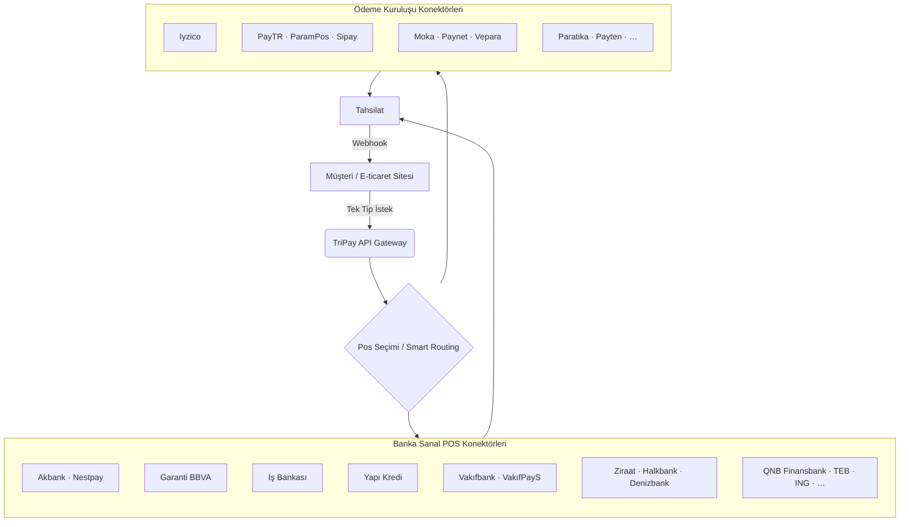

> Tüm kanal listesi ve işlem tipleri: **§6** tablosu.

### 5.6. Güvenlik, işlem motoru ve mesaj kuyruğu (özet)

Tam mimari, tehdit modeli, Docker Compose ve Kubernetes manifestleri: **[TriPay_Guvenlik_ve_Altrapi_Dokumani.md](./TriPay_Guvenlik_ve_Altrapi_Dokumani.md)**.

| Bileşen | Rol | Repo durumu |
| :--- | :--- | :--- |
| **Redis** | 3D state, idempotency, dağıtık kilit, rate limit | ✅ `TriPay.Infrastructure/Redis` — `AddTriPayRedis()` |
| **RabbitMQ** | Üye işyeri webhook (async), DLQ, retry | ✅ Outbox + `OutboxDispatcherHostedService` (RabbitMQ.Client); MassTransit ileri faz |
| **MSSQL** | `Transactions` + `TransactionLogs` (ACID) | ✅ `TriPay.Data` + FluentMigrator + EF Core |
| **Idempotency** | Callback/Auth3DS replay engeli | ✅ `PaymentGatewayService` |
| **PCI maskeleme** | Log payload | ✅ `PciDataMasker` |
| **Webhook HMAC** | Üye işyeri bildirimi | ✅ `WebhookSignatureHelper` |
| **docker-compose** | redis + rabbitmq + mssql (dev) | ✅ `docker-compose.yml` |
| **Kubernetes** | tripay namespace, deployment, NetworkPolicy | ✅ `deploy/kubernetes/` |

### 5.3. Katmanlar ve Solution Yapısı

```text
TriPay.sln
├── TriPay.Core               (Result, Redis sözleşmeleri, Idempotency, VakifbankSaleState)
├── TriPay.Data               (EF Core, FluentMigrator, Repository)
├── TriPay.Services           (Gateway provider'lar, PaymentGatewayService, Checkout)
├── TriPay.Infrastructure     (Redis, RabbitMQ outbox, arka plan worker'lar)
├── TriPay.Web/              (Kurumsal site + kılavuz — path modülleri)
├── TriPay.Demo/             (Hosted checkout demosu)
└── TriPay.Tests              (xUnit)
```

**Katman bağımlılık yönü:**

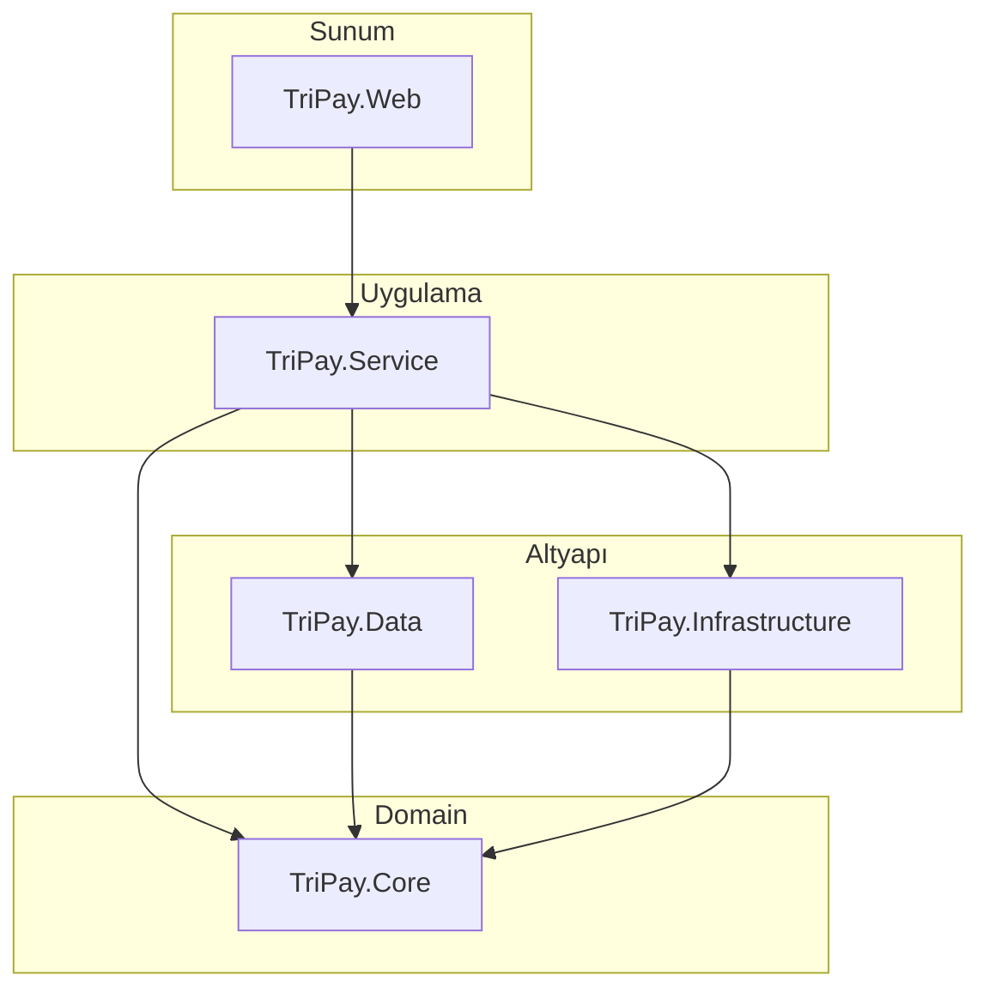

### 5.4. Ödeme Entegrasyon Mimarisi

> **Not — Payment alt yapısı (Trimango ile uyum)**  
> TriPay'deki **Payment** modülü; servisler, `interface`'ler, `controller` uçları ve provider kayıt/DI düzeni **Trimango** projesindeki `PaymentGateways` yapısıyla aynı modelde olacaktır. Yani `IPaymentGatewayProvider`, `PaymentGatewayBase`, `PaymentGatewayFactory`, `IPaymentGatewayService` / `PaymentGatewayService` ve controller tarafındaki `InitializePayment`, `ProcessCallback`, `GetInstallmentInfo` akışları Trimango'daki payment provider desenine birebir uyumlu tutulur; yeni banka/kuruluş eklemek Trimango'daki gibi provider + factory kaydı ile yapılır.
>
> **Klasör notu:** Trimango’da `PaymentGateways/` ayrı bir modül klasörüdür; `TriPay.Services` projesinin tamamı zaten yalnızca ödeme hub’ı olduğu için ek bir `PaymentGateways/` katmanı gereksizdir. Desen aynıdır; fiziksel yapı düz `TriPay.Services/{Common,Interfaces,Models,Providers}` şeklindedir (§5.4 ağaç).

**Klasör yapısı (hedef):**

```text
TriPay.Services/                    ← NuGet paketi TriPay; tüm proje ödeme hub’ıdır
├── Common/
│   ├── Result.cs
│   └── PaymentGatewayBase.cs
├── Interfaces/
│   ├── IPaymentGatewayProvider.cs
│   └── IPaymentGatewayService.cs
├── Models/
│   ├── PaymentGatewayInitializeRequestDto.cs
│   ├── PaymentGatewayCallbackResponseDto.cs
│   └── … (her DTO **tek dosya** — Kural #14)
├── Providers/
│   ├── VakifPays/
│   │   ├── VakifPaysGatewayProvider.cs
│   │   ├── Models/          (PaymentRequest.cs, SaleResponse.cs, …)
│   │   └── Helpers/         (VakifPaysHttpHelper, AutoPostHtml)
│   ├── Iyzico/              ← ✅ P1
│   ├── Vakifbank/
│   │   ├── VakifbankGatewayProvider.cs
│   │   ├── Models/VakifbankSaleState.cs
│   │   └── Services/
│   │       ├── RedisVakifbankSaleStateStore.cs   ← Redis (IDistributedCache)
│   │       └── IVakifbankSaleStateStore.cs
│   └── … (§6 — 37 kanal)
├── DependencyInjection/
│   └── PaymentGatewayServiceCollectionExtensions.cs   → AddTriPay()
├── PaymentGatewayService.cs
├── PaymentGatewayFactory.cs
└── PaymentGatewayNames.cs
    └── PaymentGatewayNames.cs          ← gateway kod sabitleri (const)
```

**Gateway sabitleri (`PaymentGatewayNames`):**

```csharp
// Magic string yasak — örnek:
PaymentGatewayNames.VakifPays
PaymentGatewayNames.Iyzico
PaymentGatewayNames.Garanti
PaymentGatewayNames.Default   // varsayılan (= VakifPays)
```

Yeni provider eklerken: `PaymentGatewayNames` + `PaymentGatewayFactory` + provider sınıfı birlikte güncellenir.

**Desen ve sorumluluklar:**

| Sınıf / Arayüz | Görevi | Pattern |
| :--- | :--- | :--- |
| `IPaymentGatewayProvider` | Tüm ödeme kuruluşlarının uyması gereken sözleşme | Interface Segregation |
| `PaymentGatewayBase` | Ortak işlevselliği barındıran soyut sınıf | Template Method |
| `{Kanal}GatewayProvider` | §6’daki her POS için adaptör (ör. `VakifPays`, `Iyzico`, `Garanti`…) | Adapter |
| `PaymentGatewayFactory` | İhtiyaç duyulan adaptörü dinamik sağlar | Factory |
| `IPaymentGatewayService` / `PaymentGatewayService` | İş mantığını yürüten facade | Facade |

**Provider sözleşmesi (tüm POS adaptörleri):**

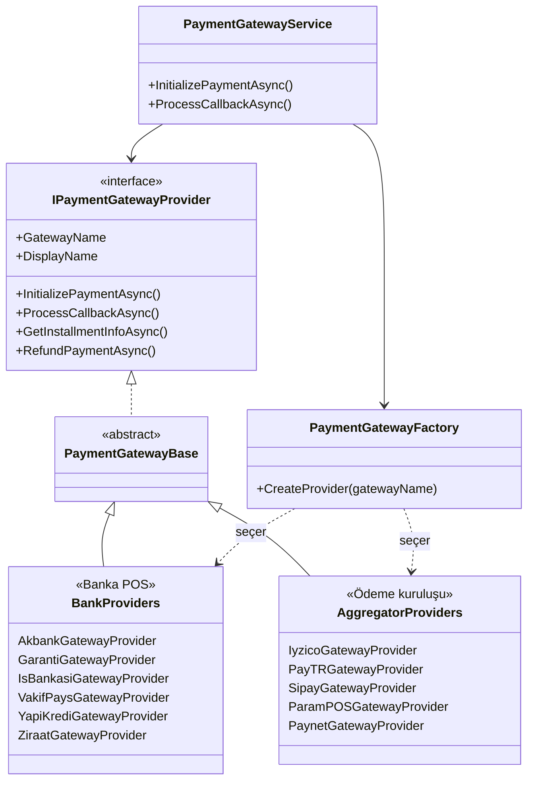

### 5.5. Geliştirici / üye işyeri provider seçimi (SOLID)

TriPay’i entegre eden **geliştirici (üye işyeri)**, hangi banka ve ödeme kuruluşu provider’larının kullanılacağını **açıkça belirtebilmeli**; sistem bunu merkezi policy ile doğrular. Tasarım **Trimango `PaymentGateways` + ayar modeli** ile uyumludur.

#### İş kuralları (özet)

| Kural | Açıklama |
| :--- | :--- |
| Kayıt | Provider yalnızca `PaymentGatewayFactory`’de kayıtlı ve §6 listesinde ise seçilebilir |
| Üye işyeri yetkisi | Merchant yalnızca **kendi aktif ettiği** kanalları kullanır (`MerchantGateways`) |
| İstek bazlı seçim | Ödeme isteğinde `GatewayName` verilebilir; verilmezse **varsayılan kanal** |
| Doğrulama | Seçilen kanal: kayıtlı + merchant’ta aktif + `IsSystemActive` + `IsSupportedAsync` |
| Smart routing | İleride: başarısız kanalda sıradaki **enabled** kanala fallback (Faz 2+) |

#### Üç katmanlı seçim modeli

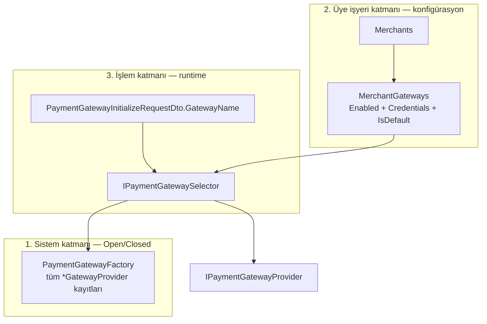

| Katman | Kim belirler? | Nerede saklanır? |
| :--- | :--- | :--- |
| **Sistem** | TriPay platformu (hangi adaptörler kodda var) | Factory dictionary + `PaymentGateways` tablosu |
| **Üye işyeri** | Entegrasyon yapan developer / merchant admin | `MerchantGateways` (+ panel veya API) |
| **İşlem** | Checkout veya backend API çağrısı | `GatewayName` alanı (DTO) |

#### SOLID prensiplere uyum

| Prensip | TriPay uygulaması |
| :--- | :--- |
| **S** — Single Responsibility | `IPaymentGatewayProvider`: yalnızca banka/kuruluş API çağrıları. `IMerchantGatewayCatalog`: merchant’ın aktif kanal listesi. `IPaymentGatewaySelector`: hangi provider’ın bu istekte kullanılacağına karar verir. `PaymentGatewayService`: orkestrasyon (Facade). |
| **O** — Open/Closed | Yeni banka = yeni `*GatewayProvider` + Factory kaydı; `PaymentGatewayService` ve selector **değiştirilmeden** genişler. |
| **L** — Liskov Substitution | Tüm kanallar `IPaymentGatewayProvider` üzerinden değiştirilebilir; çağıran kod konkret banka sınıfına bağımlı değildir. |
| **I** — Interface Segregation | Ödeme işlemi arayüzü ile merchant konfig arayüzü ayrıdır; admin listeleme için `IReadOnlyList<GatewayOptionDto>` yeterlidir. |
| **D** — Dependency Inversion | Controller ve servisler `IPaymentGatewayService`, `IPaymentGatewaySelector`, `IMerchantGatewayCatalog` abstraction’larına bağlanır; somut `VakifPaysGatewayProvider`’a değil. |

#### Hedef arayüzler (`TriPay.Core` / `TriPay.Service`)

```text
TriPay.Core/Abstractions/Payments/
├── IPaymentGatewayProvider.cs          (mevcut — adaptör sözleşmesi)
├── IMerchantGatewayCatalog.cs          (merchant’ın enabled gateway listesi)
├── IPaymentGatewaySelector.cs          (istek + policy → provider)
└── IGatewayEligibilityPolicy.cs        (opsiyonel: smart routing kuralları)

TriPay.Services/                      (kök — ayrı PaymentGateways/ klasörü yok)
├── PaymentGatewayFactory.cs
├── PaymentGatewaySelector.cs           (IMerchantGatewayCatalog + Factory)
├── MerchantGatewayCatalog.cs           (DB: MerchantGateways)
└── Policies/
    └── DefaultOrRequestedGatewayPolicy.cs
```

**`IMerchantGatewayCatalog` (sorumluluk):**

```csharp
public interface IMerchantGatewayCatalog
{
    Task<IReadOnlyList<MerchantGatewayDto>> GetEnabledGatewaysAsync(int merchantId, CancellationToken ct = default);
    Task<MerchantGatewayDto?> GetDefaultGatewayAsync(int merchantId, CancellationToken ct = default);
    Task<bool> IsGatewayEnabledForMerchantAsync(int merchantId, string gatewayName, CancellationToken ct = default);
}
```

**`IPaymentGatewaySelector` (sorumluluk):**

```csharp
public interface IPaymentGatewaySelector
{
    Task<IPaymentGatewayProvider?> ResolveAsync(
        int merchantId,
        string? requestedGatewayName,
        CancellationToken ct = default);
}
```

**Çözümleme sırası (ResolveAsync):**

1. `requestedGatewayName` doluysa → merchant’ta enabled mi kontrol et → Factory’den provider al.  
2. Boşsa → `MerchantGateways.IsDefault = true` kaydı.  
3. Hâlâ yoksa → merchant’ın ilk `Enabled` kanalı.  
4. Provider `IsSystemActive` ve `IsSupportedAsync` değilse → `null` + anlamlı hata (`Result`).

#### Developer API ve konfigürasyon

**A) Üye işyeri paneli / REST (kanal yönetimi)**

| Metot | Endpoint (örnek) | Açıklama |
| :--- | :--- | :--- |
| `GET` | `/api/merchants/{merchantId}/gateways` | Aktif ve kullanılabilir kanal listesi |
| `PUT` | `/api/merchants/{merchantId}/gateways/{code}` | Kanalı aç/kapa, credential, varsayılan işaretle |
| `GET` | `/api/gateways/available` | Sistemde kayıtlı tüm kanallar (§6 ile kesişim) |

**Örnek yanıt — kullanılabilir kanallar:**

```json
{
  "merchantId": 42,
  "defaultGateway": "VakifPays",
  "gateways": [
    { "code": "VakifPays", "displayName": "VakıfPayS", "enabled": true, "isDefault": true },
    { "code": "Iyzico", "displayName": "iyzico", "enabled": true, "isDefault": false },
    { "code": "Garanti", "displayName": "Garanti BBVA", "enabled": false, "isDefault": false }
  ]
}
```

**B) Ödeme isteğinde kanal seçimi (entegrasyon developer’ı)**

Mevcut DTO alanı (genişletilecek):

```csharp
public class PaymentGatewayInitializeRequestDto
{
    public PaymentRequest Payment { get; set; } = new();
    /// <summary>Üye işyerinin seçtiği kanal: VakifPays, Iyzico, Garanti, …</summary>
    public string? GatewayName { get; set; }
}
```

| Senaryo | `GatewayName` | Sonuç |
| :--- | :--- | :--- |
| Müşteri bankayı seçti (hosted page) | `"Garanti"` | Garanti provider |
| Tek kanal entegrasyonu | `null` | Merchant varsayılanı |
| Smart routing (ileri) | `null` + policy | Motor enabled kanallardan seçer |

**C) Veritabanı — `MerchantGateways` (§9.3)**

| Kolon | Açıklama |
| :--- | :--- |
| `MerchantId` | Üye işyeri |
| `PaymentGatewayId` | Kanal tanımı |
| `IsEnabled` | Developer’ın bu kanalı kullanıma açması |
| `IsDefault` | Varsayılan kanal (merchant başına tek) |
| `EncryptedCredentials` | POS API anahtarları |
| `Priority` | Smart routing önceliği (opsiyonel) |

**Unique:** `(MerchantId, PaymentGatewayId)` — aynı kanal iki kez eklenemez.

#### Hosted Payment Page — kullanıcı seçimi

Checkout’ta yalnızca `IsEnabled = true` kanalların logoları listelenir; kullanıcı seçimi `GatewayName` olarak POST edilir. Developer, panelden hangi logoların görüneceğini **MerchantGateways** ile kontrol eder.

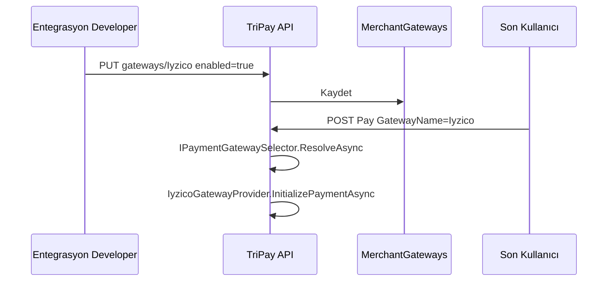

#### Hata kodları (öneri)

| Kod | Durum |
| :--- | :--- |
| `GATEWAY_NOT_REGISTERED` | Factory’de yok |
| `GATEWAY_NOT_ENABLED_FOR_MERCHANT` | Merchant bu kanalı açmamış |
| `GATEWAY_NOT_SUPPORTED` | `IsSupportedAsync` false |
| `GATEWAY_INACTIVE` | `IsSystemActive` false |
| `DEFAULT_GATEWAY_NOT_CONFIGURED` | Varsayılan yok ve istekte ad verilmemiş |

> **Zorunlu:** Yeni özellik veya endpoint yazan AI/geliştirici, provider seçimini **bu bölüm ve §9.3 `MerchantGateways`** dışında özel/if/else ile çözemez; `IPaymentGatewaySelector` kullanılır.

### 5.6. Tüm POS konektör haritası

`PaymentGatewayFactory` üzerinden erişilen hedef kanallar (§6 ile uyumlu):

```mermaid
flowchart LR
    F[PaymentGatewayFactory]

    subgraph BNK["Bankalar"]
        direction TB
        N1[Akbank]
        N2[Akbank Nestpay]
        N3[Alternatif Bank]
        N4[Anadolubank]
        N5[Denizbank]
        N6[QNB Finansbank]
        N7[Finansbank Nestpay]
        N8[Garanti BBVA]
        N9[Halkbank]
        N10[ING Bank]
        N11[İş Bankası]
        N12[Şekerbank]
        N13[Türk Ekonomi Bankası]
        N14[Türkiye Finans]
        N15[Vakıfbank]
        N16[Yapı Kredi]
        N17[Ziraat Bankası]
        N18[Kuveyt Türk]
        N19[Vakıf Katılım]
    end

    subgraph AGG["Ödeme kuruluşları"]
        direction TB
        A1[Cardplus]
        A2[Paratika]
        A3[Payten MSU]
        A4[Iyzico]
        A5[Sipay]
        A6[QNBpay]
        A7[ParamPos]
        A8[PayBull]
        A9[Parolapara]
        A10[IQmoney]
        A11[Ahlpay]
        A12[Moka]
        A13[Vepara]
        A14[ZiraatPay]
        A15[VakıfPayS]
        A16[Tami]
        A17[HalkÖde]
        A18[PayNKolay]
        A19[Paynet]
    end

    F --> BNK
    F --> AGG
```

| Durum | Açıklama |
| :--- | :--- |
| **Mevcut (kod)** | **VakıfPayS**, **iyzico**, **Vakıfbank** (Factory + `AddTriPay`) |
| **Planlanan** | Haritadaki diğer tüm kutular — §6 tablosu ile birebir |

### 5.7. Akış Şeması (3D Secure — Controller)

MVC uygulaması; seçilen POS’a göre ilgili provider ve 3D sayfası devreye girer (örnek: VakıfPayS **mevcut**, diğerleri **planlanan**):

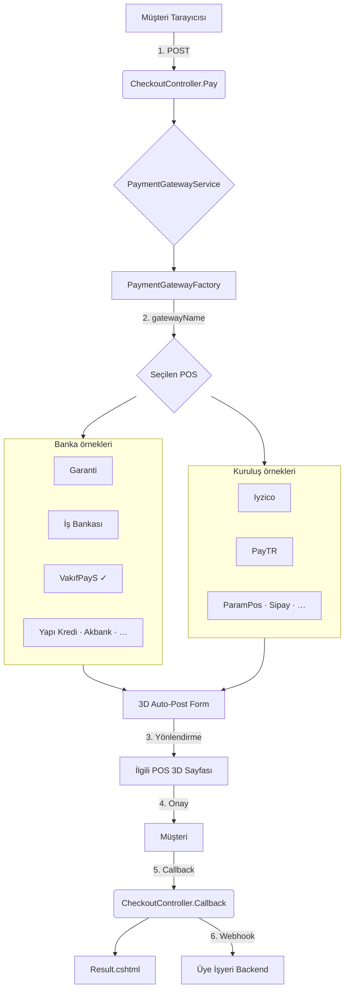

### 5.8. Akış Şeması (3D Secure — Sequence)

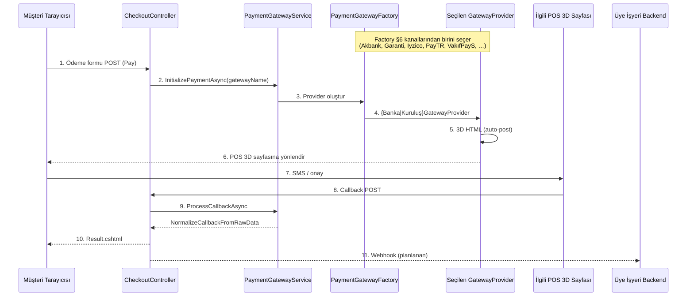

---

## 6. Olması gerekenler — Kullanılabilir Sanal POS'lar

TriPay'in **%100 adaptasyon** hedefi kapsamında desteklenmesi planlanan banka ve ödeme kuruluşu sanal POS listesi aşağıdadır. Her kanal için hedef işlem tipleri: **Satış**, **Satış 3D**, **İptal**, **İade**.

### 6.1. Öncelik TODO — MVP provider'lar (yapılacaklar)

> **Canlı checklist:** [pwd.md](../pwd.md) (proje kökü — öncelik sırası ve checkbox’lar)  
> **Dış config (`appsettings` örnekleri, tüm §6 kanalları):** [Kullanım Kılavuzu §7.7 Config şablonları (A–R)](./TriPay_Kullanim_Kilavuzu.md#77-config-şablonları-ar)

Aşağıdaki sıra **bağlayıcı önceliktir**. Yeni adaptörler Trimango `PaymentGateways/Providers` implementasyonlarından port edilir; TriPay’de `PaymentGatewayNames`, `PaymentGatewayFactory`, `AddTriPay()` DI kaydı ve gerekirse `{Kanal}Service` (HTTP) tamamlanır.

| Öncelik | Kanal | `PaymentGatewayNames` | TriPay hedef dosya | Trimango kaynak (port) | Durum |
| :---: | :--- | :--- | :--- | :--- | :---: |
| **1** | **iyzico** | `Iyzico` | `TriPay.Services/Providers/Iyzico/` | `trimango/.../IyzicoGatewayProvider.cs` | ✅ Tamamlandı |
| **2** | **Vakıfbank** | `Vakifbank` | `TriPay.Services/Providers/Vakifbank/` | `trimango/.../VakifbankGatewayProvider.cs` | ✅ Tamamlandı |
| **3** | **VakıfPayS** | `VakifPays` | `TriPay.Services/Providers/VakifPays/` | — | ✅ Tamamlandı |

**Öncelik 1 — iyzico (TODO)**

- [ ] `IyzicoGatewayProvider` Trimango’dan uyarlanacak (`InitializePayment`, `ProcessCallback`, taksit, iade/iptal, 3DS)
- [ ] `PaymentGatewayFactory`: `[PaymentGatewayNames.Iyzico] = typeof(IyzicoGatewayProvider)`
- [ ] `AddTriPay()`: `IyzicoGatewayProvider` + `HttpClient` kaydı
- [ ] Ayarlar: `ApiKey`, `SecretKey`, test/prod URL (`sandbox-api.iyzipay.com` / `api.iyzipay.com`) — Trimango `IPaymentSettingsService` yerine TriPay `IOptions` / config
- [ ] Tablo §6: **Iyzico** satırı → `Mevcut`

**Öncelik 2 — Vakıfbank (TODO)**

- [ ] `VakifbankGatewayProvider` Trimango’dan uyarlanacak (MPI Enrollment + Vpos Verify, XML, 3D)
- [ ] `PaymentGatewayFactory`: `[PaymentGatewayNames.Vakifbank] = typeof(VakifbankGatewayProvider)`
- [x] `AddTriPay()`: `RedisVakifbankSaleStateStore` + StackExchange.Redis (`TriPay:Redis`); taksit BIN listesi config (`BinPrefixes`)
- [ ] Ayarlar: `MerchantId`, `MerchantPassword`, `TerminalNo`, enrollment/verify URL’leri
- [ ] Tablo §6: **Vakıfbank** satırı → `Mevcut`

**Öncelik 3 — VakıfPayS (tamamlandı)**

- [x] `VakifPaysGatewayProvider` (`HttpPaymentGatewayBase`, Iyzico ile aynı desen)
- [x] Factory + DI kaydı
- [x] `PaymentGatewayNames.VakifPays` / `Default`

> Trimango tam yolları (geliştirici makinesi):  
> `/Users/mehmet/Project/trimango/src/Libraries/Trimango.Services/PaymentGateways/Providers/IyzicoGatewayProvider.cs`  
> `/Users/mehmet/Project/trimango/src/Libraries/Trimango.Services/PaymentGateways/Providers/VakifbankGatewayProvider.cs`

---

> **Referans görsel** (ekosistem haritası):  
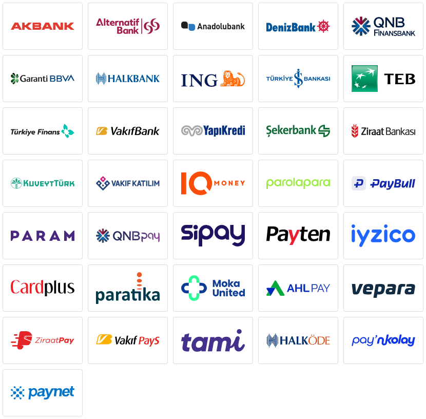

**Semboller:** ✔️ Desteklenecek · ❌ İlk fazda desteklenmeyecek (API kısıtı veya sonraki faz)

**TriPay kod durumu:** `Mevcut` = adaptör yazıldı · `TODO P1/P2` = §6.1 öncelik sırası · `Planlanan` = hedef listede, henüz yok

| Sanal POS | Satış | Satış 3D | İptal | İade | TriPay |
| :--- | :---: | :---: | :---: | :---: | :---: |
| Akbank | ✔️ | ✔️ | ✔️ | ✔️ | Planlanan |
| Akbank Nestpay | ✔️ | ✔️ | ✔️ | ✔️ | Planlanan |
| Alternatif Bank | ✔️ | ✔️ | ✔️ | ✔️ | Planlanan |
| Anadolubank | ✔️ | ✔️ | ✔️ | ✔️ | Planlanan |
| Denizbank | ✔️ | ✔️ | ✔️ | ✔️ | Planlanan |
| QNB Finansbank | ✔️ | ✔️ | ✔️ | ✔️ | Planlanan |
| Finansbank Nestpay | ✔️ | ✔️ | ✔️ | ✔️ | Planlanan |
| Garanti BBVA | ✔️ | ✔️ | ❌ | ❌ | Planlanan |
| Halkbank | ✔️ | ✔️ | ✔️ | ✔️ | Planlanan |
| ING Bank | ✔️ | ✔️ | ✔️ | ✔️ | Planlanan |
| İş Bankası | ✔️ | ✔️ | ✔️ | ✔️ | Planlanan |
| Şekerbank | ✔️ | ✔️ | ✔️ | ✔️ | Planlanan |
| Türk Ekonomi Bankası | ✔️ | ✔️ | ✔️ | ✔️ | Planlanan |
| Türkiye Finans | ✔️ | ✔️ | ✔️ | ✔️ | Planlanan |
| Vakıfbank | ✔️ | ✔️ | ✔️ | ✔️ | **Mevcut** |
| Yapı Kredi Bankası | ✔️ | ✔️ | ❌ | ❌ | Planlanan |
| Ziraat Bankası | ✔️ | ✔️ | ✔️ | ✔️ | Planlanan |
| Cardplus | ✔️ | ✔️ | ✔️ | ✔️ | Planlanan |
| Paratika | ✔️ | ✔️ | ✔️ | ✔️ | Planlanan |
| Payten - MSU | ✔️ | ✔️ | ✔️ | ✔️ | Planlanan |
| Iyzico | ✔️ | ✔️ | ✔️ | ✔️ | **Mevcut** |
| Sipay | ✔️ | ✔️ | ✔️ | ✔️ | Planlanan |
| QNBpay | ✔️ | ✔️ | ✔️ | ✔️ | Planlanan |
| ParamPos | ✔️ | ✔️ | ✔️ | ✔️ | Planlanan |
| PayBull | ✔️ | ✔️ | ✔️ | ✔️ | Planlanan |
| Parolapara | ✔️ | ✔️ | ✔️ | ✔️ | Planlanan |
| IQmoney | ✔️ | ✔️ | ✔️ | ✔️ | Planlanan |
| Ahlpay | ✔️ | ✔️ | ✔️ | ✔️ | Planlanan |
| Moka | ✔️ | ✔️ | ✔️ | ✔️ | Planlanan |
| Vepara | ✔️ | ✔️ | ✔️ | ✔️ | Planlanan |
| ZiraatPay | ✔️ | ✔️ | ✔️ | ✔️ | Planlanan |
| **VakıfPayS** | ✔️ | ✔️ | ✔️ | ✔️ | **Mevcut** |
| Tami | ✔️ | ✔️ | ✔️ | ✔️ | Planlanan |
| HalkÖde | ✔️ | ✔️ | ✔️ | ✔️ | Planlanan |
| Kuveyt Türk | ✔️ | ✔️ | ❌ | ❌ | Planlanan |
| Vakıf Katılım | ✔️ | ✔️ | ❌ | ❌ | Planlanan |
| PayNKolay | ✔️ | ✔️ | ✔️ | ✔️ | Planlanan |
| Paynet | ✔️ | ✔️ | ✔️ | ✔️ | Planlanan |

**Notlar:**

- Garanti BBVA, Yapı Kredi, Kuveyt Türk ve Vakıf Katılım için iptal/iade (❌) sonraki faz veya banka API kısıtına göre değerlendirilir.
- Yeni provider eklerken `GatewayName` bu tablodaki adlarla uyumlu olmalı; Trimango tarafındaki mevcut provider isimleri referans alınabilir.
- MVP §6.1 tamamlandı: **VakıfPayS**, **iyzico**, **Vakıfbank**. Diğer §6 satırları genişleme backlog'udur.

---

## 7. Özellik Seti (Kapsam)

### Faz 1: Temel Entegrasyon (MVP)

| Özellik | Açıklama |
| :--- | :--- |
| **Ortak ödeme formu (Hosted Payment Page)** | Tüm banka ve kuruluş logolarının tek formda toplanması |
| **Direkt API ile ödeme** | Non-3D ve 3D Secure modelleri |
| **iyzico adaptörü** | Kart saklama (Card Storage), tek tıkla ödeme |
| **Garanti BBVA ve Yapı Kredi** | Sanal pos entegrasyonu |
| **Ortak callback ve webhook** | Başarılı/başarısız bildirimlerin tek yapıda iletilmesi |

### Faz 2: Gelişmiş Özellikler

| Özellik | Açıklama |
| :--- | :--- |
| **Split payment** | Pazaryeri çözümü; komisyon otomatik dağıtımı |
| **Para iadesi (Refund)** | Kısmi ve tam iade |
| **Link ile ödeme** | SMS/e-posta ile müşteriye ödeme linki |
| **Abonelik yönetimi** | Tekrarlayan ödemeler (Recurring) |
| **Taksit yönetimi** | Banka kampanyaları ve vade farklarına otomatik uyum |

### Faz 3: Yapay Zeka ve Analitik

| Özellik | Açıklama |
| :--- | :--- |
| **Akıllı POS yönlendirme** | Hangi bankanın hangi saatte ve hangi kartta daha başarılı olduğunu öğrenen modül |
| **Dolandırıcılık tespiti** | Kara liste kontrolü ve şüpheli işlem uyarıları |

---

## 8. Webhook / Callback Yapılandırması

TriPay ödeme sonuçlarını iki kanaldan iletir: banka callback (senkron) ve üye işyeri webhook (asenkron, planlanan).

### 8.1. Banka Callback (Senkron)

Banka, 3D Secure tamamlandıktan sonra tarayıcıyı TriPay callback URL'ine yönlendirir.

| Özellik | Detay |
| :--- | :--- |
| **Endpoint** | `POST /Home/Callback` |
| **Attribute** | `[AllowAnonymous]` + `[IgnoreAntiforgeryToken]` |
| **Gelen veri** | `IFormCollection` (bankanın POST form verileri) |
| **İşleyen** | `ProcessCallbackAsync` → `NormalizeCallbackFromRawData` |
| **Sonuç** | `Result.cshtml` render |

**Örnek banka dönüş alanları (VakıfPayS):**

| Alan | Örnek |
| :--- | :--- |
| `responseCode` | `00` |
| `responseMsg` | `Onaylandı` |
| `merchantPaymentId` | `TRIPAY-2024-001` |
| `pgTranId` | `123456789` |

**Ham metin örneği (VakıfPayS POST alanları):**

```text
responseCode: 00
responseMsg: Onaylandı
merchantPaymentId: TRIPAY-2024-001
pgTranId: 123456789
```

### 8.2. Üye İşyeri Webhook (Asenkron — Planlanan)

Başarılı callback sonrası üye işyerine HTTP POST ile bildirim.

| Özellik | Detay |
| :--- | :--- |
| **Amaç** | Banka onayı sonrası üye işyerini bilgilendirme |
| **Tetikleyici** | `CheckoutController.Callback` içinde başarılı işlem |
| **Endpoint** | Üye işyerinin kaydettiği `WebhookUrl` |
| **Yöntem** | `POST` (JSON) |
| **İmza** | HMAC-SHA256 header doğrulaması |
| **Tekrar** | Başarısız webhook 3 kez (5 dk aralık) |

**Webhook payload örneği:**

```json
{
  "orderNumber": "TRIPAY-2024-001",
  "transactionId": "123456789",
  "status": "Success",
  "amount": 100.00,
  "currency": "TRY",
  "installmentCount": 1,
  "paidAmount": 100.00,
  "responseCode": "00",
  "message": "Onaylandı",
  "timestamp": "2026-05-22T14:30:00Z"
}
```

### 8.3. Webhook Güvenliği

| Adım | Açıklama |
| :--- | :--- |
| 1. Gizli anahtar | Üye işyerine özel `WebhookSecret` |
| 2. İmza | `HMAC-SHA256(payload + timestamp, secret)` |
| 3. Header | `X-TriPay-Signature`, `X-TriPay-Timestamp` |
| 4. Doğrulama | Üye işyeri imzayı kendi hesabıyla karşılaştırır |

**Üye işyeri doğrulama örneği (C#):**

```csharp
public bool ValidateWebhook(string payload, string signature, string timestamp, string secret)
{
    var computed = ComputeHmacSha256(payload + timestamp, secret);
    return computed == signature;
}

private static string ComputeHmacSha256(string data, string secret)
{
    using var hmac = new HMACSHA256(Encoding.UTF8.GetBytes(secret));
    var hash = hmac.ComputeHash(Encoding.UTF8.GetBytes(data));
    return Convert.ToBase64String(hash);
}
```

---

## 9. Veritabanı Mimarisi (MSSQL)

TriPay için **birincil veritabanı: Microsoft SQL Server 2022+** (`TriPay.Data`, EF Core Code-First). Gelen istekler ve banka/POS cevapları **kalıcı olarak tutulacaktır** — özet `Transactions`, ham log `TransactionLogs`.

### 9.1. Karar: İstek/cevap loglama ve veritabanı seçimi

**Loglama kararı:** Tüm ödeme adımlarında (Pay, Callback, Query, Refund) **request ve response** veritabanına yazılır. Bu zorunludur; bellek içi `PendingPayments` yeterli değildir.

| Neden | Açıklama |
| :--- | :--- |
| Hata ayıklama | Banka/POS formatları farklıdır; ham log şart |
| İtiraz / chargeback | İşlem anı kanıtı |
| Denetim | FinTech audit trail |
| Operasyon | Webhook tekrarları, smart routing analitiği |

**Veritabanı kararı: MSSQL** (MongoDB veya PostgreSQL ana DB olarak kullanılmaz; MVP tek DB).

| Kriter | MSSQL ✅ Seçildi | PostgreSQL | MongoDB |
| :--- | :--- | :--- | :--- |
| .NET / EF Core uyumu | Çok güçlü | İyi | Orta |
| Merchant → Transaction → Log ilişkisi | FK + ACID | FK + ACID | Zayıf |
| POS şifreleri (Always Encrypted) | ✔️ | Farklı model | ✔️ yok |
| Ham log (büyük JSON/form) | `NVARCHAR(MAX)` | `JSONB` | Doğal |
| TriPay doküman / yığın | **Resmi seçim** | İleride alternatif | Sadece arşiv (ileri faz) |

> **Not:** Yüksek hacimde eski log arşivi için ileride MSSQL + ayrı cold storage düşünülebilir; MVP’de tek MSSQL yeterlidir.

### 9.2. Temel Tablolar

| Tablo | Açıklama |
| :--- | :--- |
| `Merchants` | TriPay kullanan e-ticaret firmaları (üye işyerleri) |
| `PaymentGateways` | iyzico, Garanti, PayTR, Vakıfbank vb. kanal tanımları |
| `MerchantGateways` | Üye işyeri–banka eşlemesi; API anahtarları (Always Encrypted) |
| `Transactions` | Ödeme **özet kaydı** (sipariş no, tutar, durum, normalize edilmiş sonuç kodu) — **ham request/response burada tutulmaz** |
| `TransactionLogs` | Her API adımının **request ve response** logları (Initialize, Callback, Query, Refund vb.) — hata ayıklama ve denetim |
| `Cards` | PCI-DSS uyumlu tokenize kart bilgileri |
| `SubMerchants` | Pazaryeri alt işletmeleri |
| `WebhookLogs` | Üye işyerine gönderilen webhook kayıtları (planlanan) |
| `WebhookConfigurations` | Webhook URL ve secret (planlanan) |

### 9.3. Detaylı tablo şemaları (MSSQL)

Aşağıdaki şemalar implementasyon için **bağlayıcı** tablo tanımıdır. Migration: FluentMigrator veya EF Core Migrations.

#### `Transactions` — ödeme özeti (request/response **yok**)

| Kolon | Tip | Zorunlu | Açıklama |
| :--- | :--- | :---: | :--- |
| `Id` | `INT` IDENTITY | ✔️ | PK |
| `MerchantId` | `INT` | ✔️ | FK → `Merchants` |
| `PaymentGatewayId` | `INT` | ✔️ | FK → `PaymentGateways` |
| `MerchantGatewayId` | `INT` | | FK → `MerchantGateways` (kullanılan pos) |
| `OrderNumber` | `NVARCHAR(64)` | ✔️ | Üye işyeri sipariş no (unique per merchant) |
| `ExternalTransactionId` | `NVARCHAR(128)` | | Banka `pgTranId` vb. |
| `Amount` | `DECIMAL(18,2)` | ✔️ | İşlem tutarı |
| `Currency` | `NVARCHAR(3)` | ✔️ | Örn. `TRY` |
| `InstallmentCount` | `INT` | | Taksit sayısı |
| `Status` | `NVARCHAR(32)` | ✔️ | `Pending`, `Success`, `Failed`, `Cancelled` |
| `ResponseCode` | `NVARCHAR(16)` | | Normalize kod (ör. `00`) |
| `ResponseMessage` | `NVARCHAR(512)` | | Normalize mesaj |
| `ClientIp` | `NVARCHAR(45)` | | Müşteri IP |
| `CreatedAt` | `DATETIME2` | ✔️ | UTC |
| `UpdatedAt` | `DATETIME2` | ✔️ | UTC |

**İndeksler:** `IX_Transactions_OrderNumber` (MerchantId ile unique); `IX_Transactions_ExternalTransactionId`

---

#### `TransactionLogs` — istek ve cevap logları (**her API adımı 1+ satır**)

| Kolon | Tip | Zorunlu | Açıklama |
| :--- | :--- | :---: | :--- |
| `Id` | `BIGINT` IDENTITY | ✔️ | PK |
| `TransactionId` | `INT` | ✔️ | FK → `Transactions` |
| `LogType` | `NVARCHAR(64)` | ✔️ | Aşağıdaki enum değerleri |
| `Direction` | `NVARCHAR(16)` | ✔️ | `Outbound` (TriPay→banka), `Inbound` (banka→TriPay) |
| `RequestPayload` | `NVARCHAR(MAX)` | | Giden istek (JSON veya form serialize); **kart maskeli** |
| `ResponsePayload` | `NVARCHAR(MAX)` | | Gelen cevap (ham body) |
| `HttpStatusCode` | `INT` | | HTTP durum kodu |
| `GatewayCode` | `NVARCHAR(32)` | | Seçilen gateway kodu (ör. `VakifPays`) |
| `ErrorCode` | `NVARCHAR(64)` | | Hata kodu |
| `ErrorMessage` | `NVARCHAR(1024)` | | Hata mesajı |
| `DurationMs` | `INT` | | İstek süresi (ms) |
| `CreatedAt` | `DATETIME2` | ✔️ | UTC |

**`LogType` değerleri:**

| LogType | Ne zaman yazılır? |
| :--- | :--- |
| `PayRequest` | `CheckoutController.Pay` — gelen ödeme formu/DTO (kart maskeli) |
| `InitializeRequest` | Provider → banka ödeme başlatma isteği |
| `InitializeResponse` | Banka ödeme başlatma cevabı (3D HTML dahil) |
| `CallbackRequest` | `CheckoutController.Callback` — bankanın POST formu |
| `CallbackResponse` | Callback işleme sonucu (normalize edilmiş özet JSON) |
| `QueryRequest` | `GetPaymentStatusAsync` isteği |
| `QueryResponse` | Sorgu cevabı |
| `RefundRequest` | İade isteği |
| `RefundResponse` | İade cevabı |
| `InstallmentRequest` | Taksit sorgu isteği |
| `InstallmentResponse` | Taksit sorgu cevabı |

**İndeksler:** `IX_TransactionLogs_TransactionId_CreatedAt`; `IX_TransactionLogs_LogType`

**Örnek kayıt akışı (tek ödeme):**

| Sıra | LogType | RequestPayload | ResponsePayload |
| :---: | :--- | :--- | :--- |
| 1 | `PayRequest` | MVC `PaymentRequest` JSON | — |
| 2 | `InitializeRequest` | VakıfPayS API body | — |
| 3 | `InitializeResponse` | — | Banka cevabı / 3D HTML meta |
| 4 | `CallbackRequest` | Banka `IFormCollection` | — |
| 5 | `CallbackResponse` | — | Normalize sonuç |
| 6 | `QueryRequest` | Sorgu parametreleri | — |
| 7 | `QueryResponse` | — | Sorgu cevabı |

---

#### Diğer tablolar (özet)

| Tablo | Önemli kolonlar |
| :--- | :--- |
| `Merchants` | `Id`, `Name`, `ApiKey`, `WebhookUrl`, `IsActive`, `CreatedAt` |
| `PaymentGateways` | `Id`, `Code`, `DisplayName`, `IsActive` |
| `MerchantGateways` | `Id`, `MerchantId`, `PaymentGatewayId`, `IsEnabled`, `IsDefault`, `Priority`, `EncryptedCredentials` — §5.5 developer provider seçimi |
| `WebhookLogs` | `Id`, `TransactionId`, `RequestPayload`, `ResponsePayload`, `HttpStatusCode`, `RetryCount`, `Status` |
| `WebhookConfigurations` | `Id`, `MerchantId`, `WebhookUrl`, `WebhookSecret`, `IsActive` |
| `Cards` | `Id`, `MerchantId`, `Token`, `LastFour`, `CardBrand` (PAN saklanmaz) |
| `SubMerchants` | `Id`, `MerchantId`, `ExternalId`, `Name`, `CommissionRate` |
| `GatewaySettings` | `PaymentGatewayId`, `SettingKey`, `SettingValue`, `Environment` — teknik URL/kodlar (admin §17) |
| `GatewayErrorMappings` | `ProviderErrorCode`, `UserMessage`, `Locale`, `NormalizedCode` — provider hata sözlüğü |
| `AspNetUsers` / `AspNetRoles` | Identity — **FluentMigrator ile en son faz** (§17) |

### 9.4. Mevcut kodda veritabanı kaydı var mı?

**Evet (Faz 1.1).** Ödeme akışı `PaymentCheckoutService` üzerinden MSSQL / InMemory’e yazılır:

| Ne var? | Açıklama |
| :--- | :--- |
| `TriPay.Data` | EF Core `TriPayDbContext`, `PaymentTransactionRepository`, FluentMigrator `202605220001` / `202605220002` |
| `Transactions` | `Pay` sırasında `Pending`; callback sonrası `Success` / `Failed` |
| `TransactionLogs` | `PayRequest`, `Initialize*`, `Callback*`, `Query*` — `PciDataMasker` ile maskeli payload |
| `OutboxMessages` | Başarılı ödeme sonrası `PaymentWebhookMessage` JSON; `TriPay.Infrastructure` RabbitMQ yayını |
| `CheckoutController` | `IPaymentCheckoutService` — **bellek `PendingPayments` kaldırıldı**; tutar doğrulaması `Transactions.Amount` |
| `ILogger` | Provider tabanında var; yapılandırılmış Serilog MSSQL sink **ileri faz** |

**DI:** `AddTriPayData(configuration)` → `AddTriPay()` → `AddTriPayInfrastructure()`. Uygulama başında `RunTriPayMigrations()` (InMemory hariç).

### 9.5. Transactions ve TransactionLogs ayrımı (özet)

Bir ödeme denemesi **tek satır** `Transactions` kaydı açar; banka/POS ile yapılan **her HTTP çağrısı** ayrı `TransactionLogs` satırı üretir.

| Veri | `Transactions` | `TransactionLogs` |
| :--- | :---: | :---: |
| Sipariş no, tutar, para birimi | ✔️ | — |
| İşlem durumu (Pending, Success, Failed) | ✔️ | — |
| Banka `pgTranId` / normalize sonuç kodu | ✔️ (özet) | — |
| Initialize istek gövdesi (JSON/form) | ❌ | ✔️ `RequestPayload` |
| Initialize banka cevabı | ❌ | ✔️ `ResponsePayload` |
| 3D Callback gelen POST alanları | ❌ | ✔️ `RequestPayload` |
| Query / Refund istek ve cevapları | ❌ | ✔️ ayrı log satırları |
| HTTP status, süre (ms), hata detayı | ❌ | ✔️ |

**Log tipleri (`LogType` örnekleri):** `InitializeRequest`, `InitializeResponse`, `CallbackRequest`, `CallbackResponse`, `QueryRequest`, `QueryResponse`, `RefundRequest`, `RefundResponse`

> **PCI-DSS:** `RequestPayload` / `ResponsePayload` içinde kart numarası, CVV vb. **maskelenmiş** veya hiç yazılmaz; ham kart verisi loglanmaz.

**Akış özeti:**

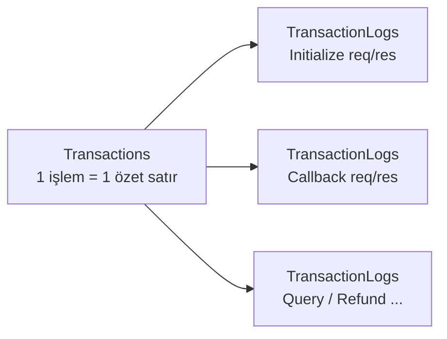

### 9.6. ER Şeması

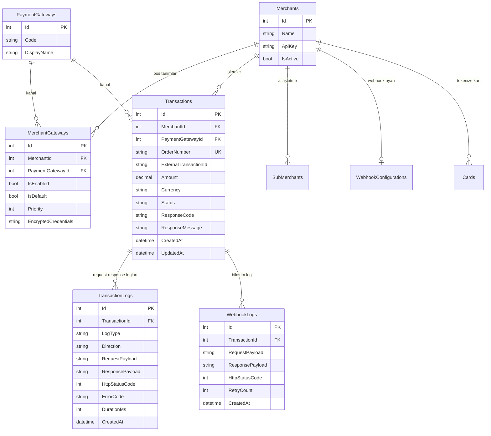

### 9.7. Veritabanı Stratejileri

| Strateji | Açıklama |
| :--- | :--- |
| **Always Encrypted** | `MerchantGateways` gizli anahtarları DB yöneticisinden de korunur |
| **Row Level Security** | Bayiler yalnızca kendi alt işletme verisini görür |
| **Sequence** | Yüksek performanslı işlem numarası üretimi |
| **Indexing** | `Transactions.OrderNumber`, `Transactions.ExternalTransactionId`; `TransactionLogs.TransactionId` + `LogType` |
| **Log boyutu** | `TransactionLogs.RequestPayload` / `ResponsePayload` için `NVARCHAR(MAX)`; eski loglar arşivlenebilir |

---

## 10. Güvenlik Katmanı (PCI-DSS Uyumluluğu)

| Güvenlik önlemi | Açıklama |
| :--- | :--- |
| **Anti-Forgery Token** | Tüm POST işlemlerde `[ValidateAntiForgeryToken]`; callback'te `[IgnoreAntiforgeryToken]` |
| **Veri işleme** | Kart numarası DB'ye yazılmadan doğrudan banka adaptörüne iletilir |
| **Şifreleme** | `appsettings` sırları Azure Key Vault / Hashicorp Vault |
| **TLS** | MSSQL bağlantısı TLS 1.2+ |
| **Webhook imzası** | Dış bildirimler HMAC-SHA256 |
| **IP kısıtlama** | Admin paneline belirli IP'lerden erişim |

---

## 11. Mevcut Kod Altyapısı ve Genişleme Planı

### 11.1. Mevcut Durum

VakıfPayS entegrasyonu çalışır durumdadır (hedef POS listesinde **§6** — tek **Mevcut** kanal).

| Bileşen | Durum |
| :--- | :--- |
| `PaymentGatewayFactory` | `[PaymentGatewayNames.VakifPays] = typeof(VakifPaysGatewayProvider)` |
| `VakifPaysGatewayProvider` | `PaymentGatewayBase`'den türemiş, metotlar implemente |
| `VakifPaysGatewayProvider` | HTTP istek/yanıt (`HttpPaymentGatewayBase`) |
| `CheckoutController` | `Pay`, `Callback`, `Installments` aktif (referans demo) |
| `HomeController` | Ana sayfa → `Checkout` yönlendirme, `Privacy`, `Error` |
| İstek/cevap DB logu | ✅ `TransactionLogs` — `PaymentCheckoutService` |
| `TriPay.Data` / MSSQL | ✅ FluentMigrator + EF Core; docker-compose `mssql` |
| Üye işyeri webhook | ✅ Outbox → RabbitMQ (`payment.webhook`); HTTP worker **ileri faz** |

### 11.2. Yeni Banka Ekleme (Trimango ile aynı adımlar)

**Hızlı özet (İş Bankası örneği):**

```csharp
// 1. IsBankasiService ve IsBankasiGatewayProvider oluştur
// 2. Factory'ye ekle: ["IsBankasi"] = typeof(IsBankasiGatewayProvider)
// 3. DI'a kaydet: services.AddHttpClient<IsBankasiService>();
```

**Adım 1 — Banka servisi:**

```csharp
// TriPay.Services/Providers/IsBankasiService.cs
public class IsBankasiService
{
    private readonly HttpClient _httpClient;
    public IsBankasiService(HttpClient httpClient) => _httpClient = httpClient;
    // Bankaya özel metotlar...
}
```

**Adım 2 — Gateway provider:**

```csharp
// TriPay.Services/Providers/IsBankasiGatewayProvider.cs
public class IsBankasiGatewayProvider : PaymentGatewayBase
{
    private readonly IsBankasiService _isBankasiService;

    public IsBankasiGatewayProvider(IsBankasiService isBankasiService, ILogger<IsBankasiGatewayProvider> logger)
        : base(logger) => _isBankasiService = isBankasiService;

    public override string GatewayName => PaymentGatewayNames.IsBankasi;
    public override string DisplayName => "İş Bankası";
    // Override metotlar...
}
```

**Adım 3 — Factory kaydı:**

```csharp
// PaymentGatewayFactory.cs
private readonly Dictionary<string, Type> _providers = new(StringComparer.OrdinalIgnoreCase)
{
    [PaymentGatewayNames.VakifPays] = typeof(VakifPaysGatewayProvider),
    [PaymentGatewayNames.IsBankasi] = typeof(IsBankasiGatewayProvider)
};
```

**Adım 4 — Dependency Injection:**

```csharp
// PaymentGatewayServiceCollectionExtensions.cs
services.AddHttpClient<IsBankasiService>();
services.AddScoped<IsBankasiGatewayProvider>();
```

Yeni banka eklendikten sonra sistem provider'ı factory üzerinden otomatik tanır.

---

## 12. Pazar ve Rakip Analizi

TriPay'in farkı, yalnızca birkaç kuruluşu (örneğin iyzico + tek banka) değil, **tüm ödeme ekosistemini** kapsayacak olmasıdır.

| Konu | Değerlendirme |
| :--- | :--- |
| **Rakipler / kanal ortakları** | CraftGate, PayTR, iyzico — hem rakip hem potansiyel entegre kanal |
| **TriPay stratejisi** | Rakiplerle doğrudan rekabet yerine onları da sisteme bağlayarak geliştiriciye en geniş havuzu sunmak |
| **Hedef** | Türkiye fintek ekosistemindeki parçalanmayı tek API altında toplamak |

---

## 13. İş Modeli

| Model | Açıklama |
| :--- | :--- |
| **Komisyon bazlı (Pay-As-You-Go)** | İşlem başına cüzi ek komisyon (ör. %0,15) |
| **Lisanslama (SaaS)** | Aylık sabit ücret + işlem başına ücret; bayi paneli dahil |
| **On-Premise kurulum** | Büyük kurumsal firmalar için müşteri sunucusuna özel kurulum |

---

## 14. Teknoloji Yığını

### 14.1. Mevcut Uygulama (TriPay kod tabanı)

| Kategori | Teknoloji |
| :--- | :--- |
| **IDE** | Visual Studio 2026 / JetBrains Rider |
| **Backend** | ASP.NET Core MVC (.NET 8+) |
| **Veritabanı** | Microsoft SQL Server 2022 |
| **ORM** | Entity Framework Core 9.0 (Code-First) |
| **Önbellek** | Redis (StackExchange.Redis) |
| **Kuyruk** | RabbitMQ (webhook kuyruğu) |
| **Admin panel** | Bootstrap 5 + jQuery |
| **Ödeme formu** | Bootstrap 5 (hosted payment page) |
| **Loglama** | Serilog (MSSQL Sink) |
| **Güvenlik** | Azure Key Vault / Hashicorp Vault |

### 14.2. Alternatif / Ölçeklenebilir Yığın Önerisi

Ana veritabanı **MSSQL** olarak kalır (§9.1). Aşağıdakiler yalnızca ileri faz / yüksek ölçek senaryosu içindir:

| Kategori | Öneri |
| :--- | :--- |
| **Backend** | Node.js (TypeScript) veya Golang |
| **Veritabanı** | İlişkisel veri MSSQL’de kalır; isteğe bağlı PostgreSQL. MongoDB yalnızca eski log arşivi (opsiyonel) |
| **Önbellek / kuyruk** | Redis, RabbitMQ (callback ve asenkron işlemler) |
| **Güvenlik** | Hashicorp Vault, PCI-DSS uyumlu tokenization |
| **Yönetim paneli** | React.js (admin dashboard) — veya mevcut Bootstrap 5 MVC paneli |

---

## 16. Güvenlik ve altyapı (bağlayıcı)

Ödeme sistemlerinde **güvenlik ve işlem bütünlüğü** kod ile eşdeğer önceliktedir. Aşağıdaki doküman, ana dokümandaki §8–§10 ile birlikte okunur:

- **[TriPay_Guvenlik_ve_Altrapi_Dokumani.md](./TriPay_Guvenlik_ve_Altrapi_Dokumani.md)** — state machine, idempotency, RabbitMQ outbox, Redis ayrımı, PCI, secrets, `docker-compose`, Kubernetes, faz planı.

**Yerel altyapı başlatma:**

```bash
docker compose up -d
dotnet run --project TriPay
```

**Üretim:** Gizliler `deploy/kubernetes/secret.yaml.example` şablonundan değil, Key Vault / External Secrets ile enjekte edilir.

---

## 15. Sonuç

TriPay, Türkiye fintek ekosistemindeki **parçalanma sorununu** çözmeyi hedefler. Geliştiricilere *«bir kere yaz, tüm bankalarda çalıştır»* özgürlüğü sunarak yeni nesil **ödeme orkestrasyonu** standardı olmayı amaçlar.

Mevcut kod tabanı **.NET Core MVC + MSSQL** üzerinde; Adapter ve Factory desenleriyle genişletilebilir bir hub mimarisine sahiptir. Payment modülü Trimango `PaymentGateways` yapısıyla uyumlu tutulur; yeni kanal eklemek provider + factory + DI adımlarıyla yapılır.

### Mevcut özellikler

- VakıfPayS sanal pos entegrasyonu
- 3D Secure ödeme akışı
- Taksit sorgulama (BIN bazlı)
- Banka callback işleme
- PCI-DSS uyumlu kart verisi işleme

### Planlanan özellikler (özet)

- Faz 1 MVP: `TriPay.Data` + MSSQL, `IMerchantGatewayCatalog` + `IPaymentGatewaySelector`, iyzico/Garanti, webhook
- Faz 2: Split payment, iade, link ile ödeme, abonelik, taksit yönetimi
- Faz 3: AI tabanlı POS yönlendirme, dolandırıcılık tespiti
- **Yönetim paneli + Identity:** **§17** — ödeme hub, webhook ve gateway metadata tamamlandıktan **sonra** (en son faz)

---

## 17. Yönetim Paneli (Admin) — EN SON FAZ

> **⚠️ Uygulama sırası:** Bu bölüm **tüm ödeme akışları, MSSQL kayıtları, gateway metadata (DB + Redis), webhook/outbox ve testler** tamamlandıktan sonra yapılır. Admin veya Identity kodu **önce** yazılmaz; önce bu doküman güncellenir, sonra implementasyon başlar.

### 17.1. Amaç

Operasyon ve destek ekiplerinin TriPay verilerini **okuyabilmesi**, gateway teknik ayarlarını ve hata sözlüğünü **yönetebilmesi**, işlem/log incelemesi yapabilmesi için ayrı bir **Bootstrap 5 MVC** yönetim uygulaması. Üye işyeri (merchant) self-servis paneli bu fazda **kapsam dışıdır**; yalnızca TriPay iç operasyon/admin kullanıcıları.

### 17.2. Solution yapısı (hedef)

```text
TriPay.sln
├── … (mevcut projeler)
└── TriPay.Admin/              # YENİ — sadece yönetim paneli (public ödeme sitesinden ayrı)
    ├── Controllers/
    ├── Views/                 # Bootstrap 5, Türkçe arayüz
    ├── Areas/Identity/        # ASP.NET Core Identity UI (isteğe bağlı scaffold)
    └── Program.cs
```

| Proje | Rol |
| :--- | :--- |
| `TriPay.Demo` | Hosted payment / demo checkout — **admin yok** |
| `TriPay.Web` | Kurumsal site, `/docs` kılavuz — **DB yok** |
| `TriPay.Admin` | Giriş korumalı yönetim paneli |
| `TriPay.Data` | Ortak DbContext, repository, **FluentMigrator** (Identity tabloları dahil) |
| `TriPay.Infrastructure` | Redis cache invalidation, health |

**Bağımlılık:** `TriPay.Admin` → `TriPay.Data` + `TriPay.Infrastructure` (+ gerekirse ince Application katmanı). Ödeme provider’ları admin projesine **taşınmaz**.

### 17.3. Kimlik doğrulama — ASP.NET Core Identity

| Karar | Açıklama |
| :--- | :--- |
| Kimlik | **Microsoft.AspNetCore.Identity** + EF Core store (`TriPayDbContext` veya `TriPayIdentityDbContext` aynı MSSQL) |
| Migration aracı | **FluentMigrator** — Identity tabloları **EF migration ile değil**, `TriPay.Data/Migrations/` altında yeni sürüm (ör. `202605220010_IdentitySchema.cs`) |
| Şifre politikası | Üretimde güçlü politika; geliştirme seed’inde dokümante edilen test hesabı |
| Roller | En az `Admin`, ileride `Support`, `ReadOnly` |
| Oturum | Cookie authentication; admin path’leri `[Authorize(Roles = "Admin")]` |

**FluentMigrator ile oluşturulacak tablolar (standart Identity şeması):**

| Tablo | Açıklama |
| :--- | :--- |
| `AspNetUsers` | Panel kullanıcıları |
| `AspNetRoles` | Roller |
| `AspNetUserRoles` | Kullanıcı–rol |
| `AspNetUserClaims` | Ek claim’ler |
| `AspNetRoleClaims` | Rol claim’leri |
| `AspNetUserLogins` | Harici giriş (ileri faz) |
| `AspNetUserTokens` | 2FA / reset token (ileri faz) |

**Seed (FluentMigrator `Up()` veya ayrı `202605220011_IdentitySeed.cs`):**

| Alan | Değer |
| :--- | :--- |
| E-posta | `admin@gmail.com` |
| Şifre | `Super123!` |
| Rol | `Admin` |

> Seed yalnızca **Development** ortamında otomatik çalıştırılabilir; üretimde ilk admin kullanıcı güvenli kanalla oluşturulur.

**DI (`TriPay.Admin/Program.cs` özet):**

```csharp
services.AddTriPayData(configuration);
services.AddTriPayInfrastructure(configuration);
services.AddIdentity<ApplicationUser, IdentityRole>()
    .AddEntityFrameworkStores<TriPayDbContext>()
    .AddDefaultTokenProviders();
services.AddRazorPages(); // Identity UI kullanılırsa
```

`RunTriPayMigrations()` uygulama açılışında Identity migration’ını da uygular.

### 17.4. Admin menüsü — görüntülenebilir / yönetilebilir modüller

Mevcut ve planlanan veritabanı kayıtlarına göre panel modülleri:

#### Dashboard (salt okunur)

| Widget | Kaynak |
| :--- | :--- |
| Günlük / haftalık işlem hacmi | `Transactions` |
| Başarı / başarısızlık oranı | `Transactions.Status` |
| Kanal bazlı dağılım | `PaymentGateways` + `Transactions` |
| Bekleyen outbox | `OutboxMessages` (gönderilmemiş) |
| Sistem durumu | `/health/ready` benzeri internal check (Redis + MSSQL) |

#### İşlemler

| Ekran | Veri | Yetki |
| :--- | :--- | :--- |
| İşlem listesi | `Transactions` — filtre: tarih, merchant, gateway, durum, sipariş no | Liste |
| İşlem detayı | Özet + ilişkili `TransactionLogs` | Detay |
| Log satırı detayı | `RequestPayload` / `ResponsePayload` (**PCI maskeli** — ham PAN gösterilmez) | Detay |
| Yeniden webhook (ileri faz) | `OutboxMessages` yeniden kuyruğa | Admin |

#### Üye işyerleri

| Ekran | Veri | Not |
| :--- | :--- | :--- |
| Merchant listesi | `Merchants` | `ApiKey` maskeli veya son 4 karakter |
| Merchant detay | `Name`, `WebhookUrl`, `IsActive`, oluşturma tarihi | Düzenleme (aktif/pasif) |
| Merchant–Gateway (ileri faz) | `MerchantGateways` | POS seçimi, öncelik, credential **vault** — panelde düz metin şifre saklanmaz |

#### Ödeme kanalları (gateway)

| Ekran | Veri | Not |
| :--- | :--- | :--- |
| Kanal listesi | `PaymentGateways` (`Code`, `DisplayName`, `IsActive`) | §6 ile uyumlu kodlar |
| Gateway ayarları | `GatewaySettings` — `SettingKey`, `SettingValue`, `Environment` (All/Test/Production) | URL, `ResultCodeSuccess`, 3D durum kodları vb. **credential değil** |
| Hata sözlüğü | `GatewayErrorMappings` — `ProviderErrorCode`, `UserMessage`, `Locale`, `NormalizedCode` | Provider cevabı → kullanıcı mesajı eşlemesi |
| Ayar kaydı sonrası | Redis invalidation | `gateway:settings:*`, `gateway:errors:*` anahtarları silinir veya TTL kısaltılır |

> **appsettings** içinde kalan alanlar (MerchantId, API secret, terminal şifresi) admin panelden **düzenlenmez**; Key Vault / ortam değişkeni kalır. Panel yalnızca **teknik/metadata** satırlarını yönetir.

#### Outbox / webhook operasyonu

| Ekran | Veri |
| :--- | :--- |
| Outbox kuyruğu | `OutboxMessages` — durum, deneme sayısı, `CreatedAt`, payload özeti |
| Webhook logları (planlanan) | `WebhookLogs` — §9.3 |

#### Sistem (salt okunur veya sınırlı)

| Ekran | Açıklama |
| :--- | :--- |
| Redis önbellek | Metadata cache istatistiği; “tüm gateway cache temizle” (Admin) |
| Migration durumu | Son FluentMigrator sürümü (salt okunur log) |
| Kullanıcı yönetimi | Identity kullanıcı/rol CRUD (Admin rolü) |

### 17.5. Teknik kurallar (admin kodu için)

| # | Kural |
| :---: | :--- |
| 1 | UI (`TriPay.Admin`): **Tailwind CSS** + Gulp (`admin.min.css` / `admin.min.js`); Bootstrap/jQuery yok; etiketler **Türkçe** |
| 2 | İş mantığı controller’da değil; liste/detay için **MediatR** query/command (ileride `TriPay.Application` ayrılırsa orada) |
| 3 | Liste sayfalarında sayfalama + sunucu tarafı filtre (EF `IQueryable`) |
| 4 | `TransactionLogs` export’unda PCI maskeleme zorunlu |
| 5 | Hassas endpoint’lerde **IP kısıtlama** (§8) — yapılandırma `TriPay:Admin:AllowedIpRanges` |
| 6 | Her admin özelliği için xUnit: handler + validator; Identity için entegrasyon testi (login + yetkisiz 403) |
| 7 | Global API response wrapper ve exception middleware admin API’si için de geçerli (JSON endpoint eklenirse) |

### 17.6. Redis ve metadata tutarlılığı

Gateway ayarı veya hata eşlemesi panelden güncellendiğinde:

1. MSSQL’de `GatewaySettings` / `GatewayErrorMappings` güncellenir  
2. `IGatewayMetadataService` için ilgili Redis anahtarları **silinir** (`RedisKeyNames.GatewaySettings`, `GatewayErrors`)  
3. Sonraki ödeme isteğinde `RedisCachedGatewayMetadataService` DB’den yeniden yükler  

Bu davranış **§9** gateway metadata implementasyonu ile bağlantılıdır; admin fazında `InvalidateGatewayCacheCommand` gibi tek bir komut üzerinden yapılır.

### 17.7. Uygulama checklist (sıra — bağlayıcı)

Aşağıdaki sıra **değiştirilmez**:

- [ ] 1. Ödeme MVP + `Transactions` / `TransactionLogs` / outbox **stabil** ve testler yeşil  
- [ ] 2. `GatewaySettings` + `GatewayErrorMappings` + Redis metadata **tamam** (mevcut kod)  
- [ ] 3. `MerchantGateways` + `IPaymentGatewaySelector` (doküman §5.5)  
- [ ] 4. Webhook HTTP worker + `WebhookLogs` (planlanan)  
- [ ] 5. **`TriPay.Admin` projesi** oluştur  
- [ ] 6. FluentMigrator: **Identity tabloları** migration  
- [ ] 7. FluentMigrator: **admin seed** (`admin@gmail.com` / `Super123!`)  
- [ ] 8. Identity + login/logout + rol yetkilendirme  
- [ ] 9. Dashboard + İşlemler + Merchants (okuma)  
- [ ] 10. Gateway ayarları + hata sözlüğü CRUD + Redis invalidation  
- [ ] 11. Outbox operasyon ekranı  
- [ ] 12. Kullanıcı/rol yönetimi, IP kısıtı, üretim hardening  

### 17.8. Kapsam dışı (bu fazda yapılmaz)

- Üye işyeri self-servis portalı (ayrı ürün)  
- React admin SPA (§14.2 alternatif yığın — isteğe bağlı ileri faz)  
- Kart PAN / CVV görüntüleme  
- Provider credential’ların panelden düz metin girilmesi  

---

**Hazırlayan:** TriPay Geliştirme Ekibi  
**Tarih:** 22 Mayıs 2026
