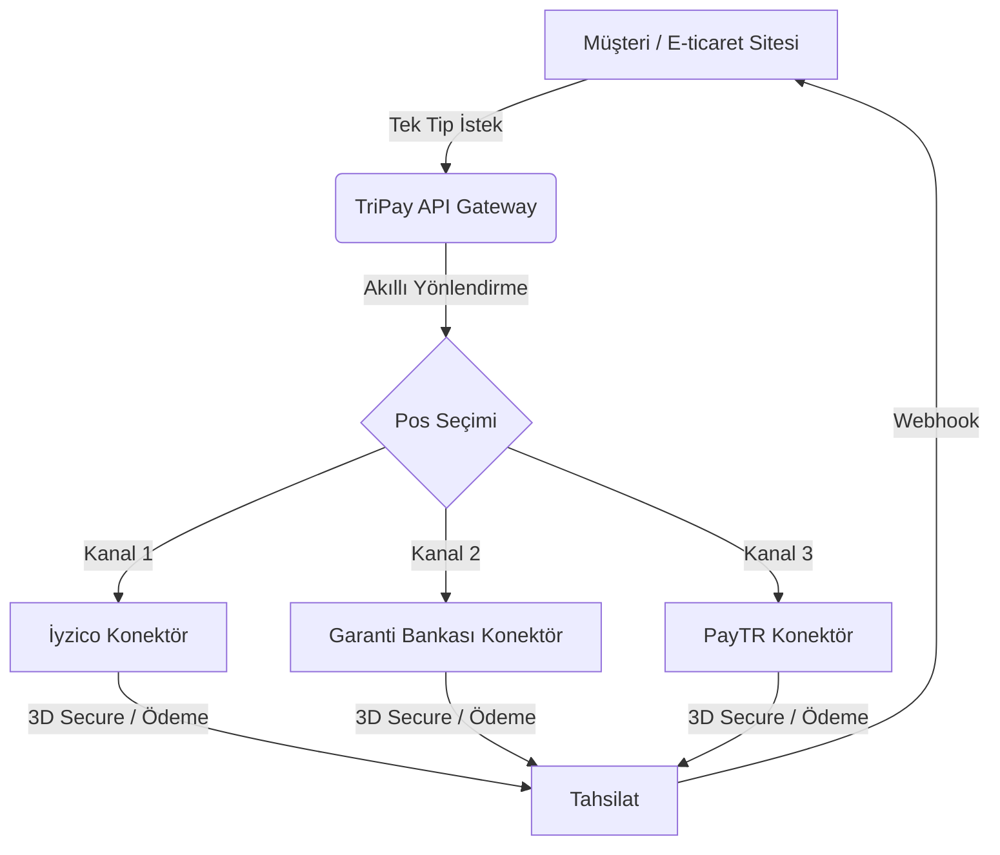
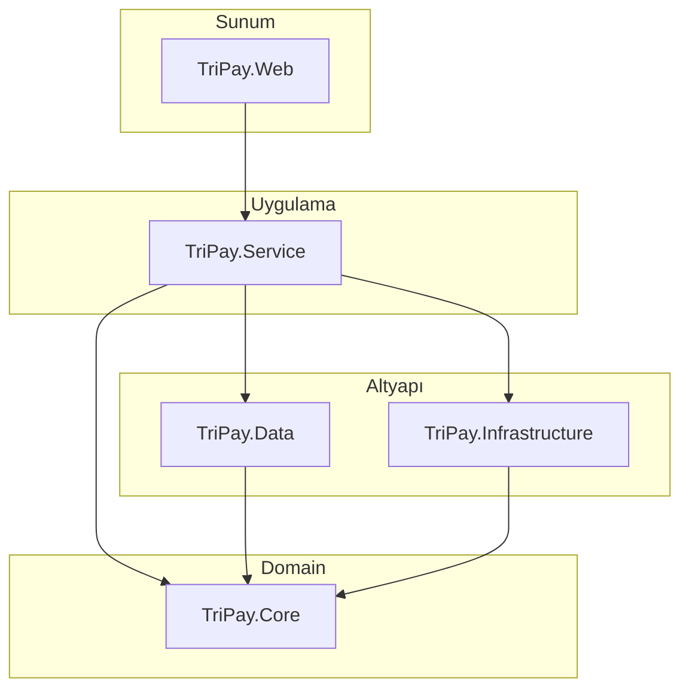
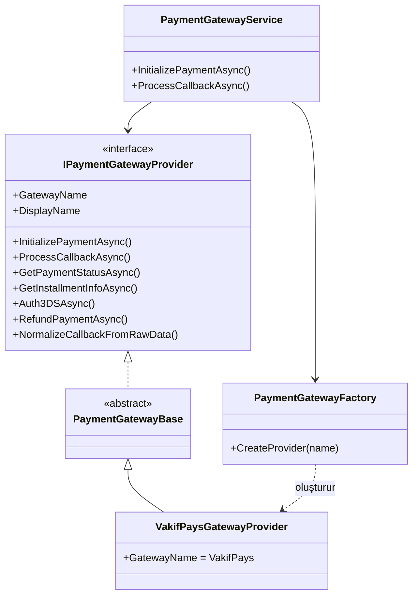
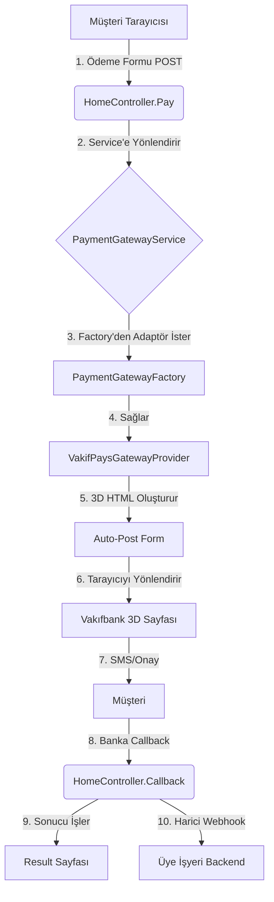
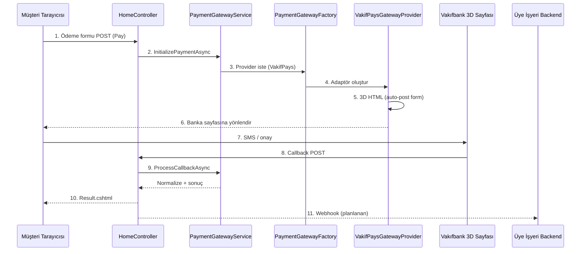
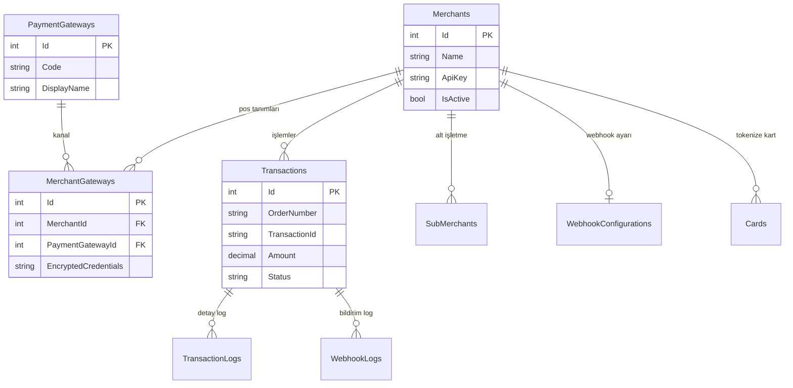

> **Dosya Adı:** `TriPay_Proje_Dokumani.md`  
> **Ana doküman** — Tüm TriPay dokümantasyonunun birleşik ve güncel sürümü.

# TriPay Proje Dokümantasyonu (v3.0 — .NET Core MVC + MSSQL)

| Alan | Değer |
| :--- | :--- |
| **Versiyon** | 3.0 |
| **Tarih** | 22 Mayıs 2026 |
| **Proje Kodu** | TRIPAY-DOC-003 |
| **Teknoloji Odağı** | Microsoft Ekosistemi (.NET Core MVC + MSSQL) |

---

## Zorunlu kural — Yapay zeka ve geliştiriciler

**⚠️ Dokümana bakmadan kod yazılmaz.**

> **Bu dosya TriPay için tek ve bağlayıcı kaynaktır:** `docs/TriPay_Proje_Dokumani.md`

**Tüm yapay zeka asistanları** (Cursor, Copilot, ChatGPT, Claude, Gemini ve benzeri tüm araçlar) ile projede çalışan **tüm geliştiriciler** için aşağıdaki kurallar **zorunludur**:

| # | Kural |
| :---: | :--- |
| 1 | TriPay üzerinde **kod yazmadan, değiştirmeden veya önermeden önce** bu dokümanın **tamamını veya ilgili bölümlerini** okumak zorundadır. |
| 2 | **Dokümana bakmadan kod yazmak yasaktır.** Mimari, isimlendirme, Payment modülü, webhook, güvenlik ve veritabanı kararları yalnızca bu dokümana göre verilir. |
| 3 | Dokümanda tanımlı olmayan mimari veya desen **uydurulamaz**; önce doküman güncellenir, sonra kod yazılır. |
| 4 | Ödeme / Payment işleri **Trimango `PaymentGateways` desenine** (bu dokümanda §5.4) uygun yapılır; `IPaymentGatewayProvider`, `PaymentGatewayBase`, `PaymentGatewayFactory`, `PaymentGatewayService` dışında alternatif yapı kurulmaz. |
| 5 | Yeni banka veya ödeme kuruluşu ekleme adımları **yalnızca §11.2** akışına göre yapılır. |
| 6 | Güvenlik (PCI-DSS, callback `[IgnoreAntiforgeryToken]`, kart verisinin DB'ye yazılmaması, webhook imzası) **§8 ve §10** ile çelişen kod üretilmez. |
| 7 | Hedef sanal POS listesi **§6** tablosundadır; tabloda olmayan kanal için provider eklenmez (önce doküman güncellenir). |

**Kontrol listesi (kod öncesi):**

- [ ] `docs/TriPay_Proje_Dokumani.md` okundu mu?
- [ ] Değişiklik ilgili bölümle (mimari, webhook, DB, genişleme planı) uyumlu mu?
- [ ] Payment değişikliği Trimango uyumlu mu?
- [ ] Planlanan özellik mi, mevcut özellik mi — **§6** POS tablosu ve durum tablolarına uygun mu?

*Bu bölüm proje sahibi tarafından zorunlu tutulur; ihlal eden çıktılar geçersiz kabul edilir.*

---

## İçindekiler

0. [Zorunlu kural — Yapay zeka ve geliştiriciler](#zorunlu-kural--yapay-zeka-ve-geliştiriciler)
1. [Proje Künyesi](#1-proje-künyesi)
2. [Proje Vizyonu ve Misyonu](#2-proje-vizyonu-ve-misyonu)
3. [Problem Tanımı](#3-problem-tanımı-neden-tripay)
4. [Proje Amacı](#4-proje-amacı)
5. [Teknik Mimari](#5-teknik-mimari)
6. [Olması gerekenler — Kullanılabilir Sanal POS'lar](#6-olması-gerekenler--kullanılabilir-sanal-poslar)
7. [Özellik Seti (Kapsam)](#7-özellik-seti-kapsam)
8. [Webhook / Callback](#8-webhook--callback-yapılandırması)
9. [Veritabanı Mimarisi](#9-veritabanı-mimarisi-mssql)
10. [Güvenlik Katmanı](#10-güvenlik-katmanı-pci-dss-uyumluluğu)
11. [Mevcut Kod ve Genişleme Planı](#11-mevcut-kod-altyapısı-ve-genişleme-planı)
12. [Pazar ve Rakip Analizi](#12-pazar-ve-rakip-analizi)
13. [İş Modeli](#13-iş-modeli)
14. [Teknoloji Yığını](#14-teknoloji-yığını)
15. [Sonuç](#15-sonuç)

---

## 1. Proje Künyesi

| Başlık | Açıklama |
| :--- | :--- |
| **Proje Adı** | TriPay |
| **Slogan** | Tüm Ödemeler Tek Platformda |
| **Proje Tipi** | FinTech / Ödeme Entegrasyon Merkezi (Payment Hub) |
| **Hedef Kitle** | E-ticaret siteleri, pazaryerleri, SaaS firmaları, mobil uygulama geliştiricileri |
| **Mimari** | Onion Architecture (Temiz Mimari) + MVC |
| **Backend** | .NET 9.0 Core MVC (Razor Views) |
| **Veritabanı** | Microsoft SQL Server 2022+ |
| **ORM** | Entity Framework Core 9.0 (Code-First) |
| **Cache / Queue** | Redis ve RabbitMQ (ihtiyaca göre) |

---

## 2. Proje Vizyonu ve Misyonu

### Vizyon

Türkiye'deki ve global pazardaki tüm sanal pos ve ödeme kuruluşu entegrasyonlarını teke düşürerek, yazılım geliştiricilerin ödeme sistemleriyle uğraşma süresini sıfıra indirmek.

### Misyon

Karmaşık banka API'larını, güvenlik protokollerini ve farklı dokümantasyonları; tek tip, basit ve güçlü bir **REST API** (ve MVC tabanlı yönetim paneli) arkasında birleştirmek.

---

## 3. Problem Tanımı (Neden TriPay?)

Bir e-ticaret sitesi geliştiricisi şu zorluklarla karşılaşır:

1. **Yüksek geliştirme maliyeti:** Her banka (Garanti, İş Bankası, Yapı Kredi vb.) ve kuruluş (iyzico, PayTR vb.) için ayrı entegrasyon haftalar sürer.
2. **Bakım zorluğu:** Banka API'ları güncellendiğinde (örneğin 3D Secure 2.0 geçişi) tüm sistemin revize edilmesi gerekir.
3. **Standart eksikliği:** Her kuruluş farklı hata kodları, callback yapıları ve hash algoritmaları kullanır.
4. **Bayi yönetimi:** Alt işletme (sub-merchant) yönetimi ve gelir bölüşümü (split payment) her platformda ayrı yapılandırma gerektirir.

---

## 4. Proje Amacı

Projenin temel amacı, **Türkiye'deki tüm banka sanal poslarını ve iyzico gibi ödeme kuruluşlarını tek platformda toplamak (aggregation)** ve geliştiricilere yalnızca **TriPay API** ile tüm kanallardan tahsilat imkânı sunmaktır.

**Alt amaçlar:**

- **%100 adaptasyon:** iyzico, PayTR, CraftGate, Garanti BBVA, Yapı Kredi, İş Bankası, Akbank, Vakıfbank, Halkbank ve diğerleri.
- **Akıllı yönlendirme (Smart Routing):** Başarısız denemede otomatik yedek banka/pos'a geçiş.
- **Tek tıkla aktivasyon:** Kullanıcıların yalnızca API anahtarı / API key ekleyerek tüm bankalara bağlanması.
- **Beyaz etiket (White Label):** Yazılım firmalarının TriPay'i kendi markası altında müşterilerine sunması.

---

## 5. Teknik Mimari

TriPay, uzun vadede **mikroservis ve API Gateway** mantığıyla ölçeklenebilir; mevcut uygulama **.NET Core MVC** üzerinde modüler bir **Payment Hub** ve yönetim paneli olarak geliştirilmektedir. Dış dünyaya tek tip istek sunar; içeride akıllı yönlendirme ile doğru pos/konektöre gider.

### 5.1. Temel Bileşenler

| Bileşen | Açıklama |
| :--- | :--- |
| **TriPay Core API** | Dış dünyaya açılan tek uç nokta; RESTful (ileride GraphQL desteği planlanabilir) |
| **Konektör servisleri** | Her banka/iyzico için bağımsız adaptörler (`{Banka}GatewayProvider`) — Adapter Pattern |
| **İşlem motoru (Transaction Engine)** | Ödeme zincirini yönetir; hata durumunda fallback / smart routing |
| **Güvenlik katmanı** | PCI-DSS uyumlu tokenization, IP kısıtlama, webhook imzası |
| **Dashboard ve raporlama** | Anlık ciro, başarısız işlem sebepleri, banka bazlı performans (planlanan) |

### 5.2. Genel Akış Şeması (API Gateway)

Üye işyeri tek tip istek atar; TriPay doğru kanala yönlendirir ve sonucu webhook ile bildirir.



### 5.3. Katmanlar ve Solution Yapısı

```text
TriPay.sln
├── TriPay.Core               (Entity'ler, Enum'lar, Interface'ler)
├── TriPay.Data               (EF Core DbContext, Repository, UnitOfWork)
├── TriPay.Service            (İş mantığı, Gateway adaptörleri, ödeme orkestrasyonu)
├── TriPay.Infrastructure   (Redis, RabbitMQ, SMS, E-mail, Logging)
└── TriPay.Web                (.NET Core MVC — Sunum katmanı)
      ├── Controllers
      ├── Views
      ├── ViewModels
      └── Middleware
```

**Katman bağımlılık yönü:**



### 5.4. Ödeme Entegrasyon Mimarisi

> **Not — Payment alt yapısı (Trimango ile uyum)**  
> TriPay'deki **Payment** modülü; servisler, `interface`'ler, `controller` uçları ve provider kayıt/DI düzeni **Trimango** projesindeki `PaymentGateways` yapısıyla aynı modelde olacaktır. Yani `IPaymentGatewayProvider`, `PaymentGatewayBase`, `PaymentGatewayFactory`, `IPaymentGatewayService` / `PaymentGatewayService` ve controller tarafındaki `InitializePayment`, `ProcessCallback`, `GetInstallmentInfo` akışları Trimango'daki payment provider desenine birebir uyumlu tutulur; yeni banka/kuruluş eklemek Trimango'daki gibi provider + factory kaydı ile yapılır.

**Klasör yapısı (hedef):**

```text
TriPay.Service/
└── PaymentGateways/
    ├── Common/
    │   └── PaymentGatewayBase.cs
    ├── Interfaces/
    │   ├── IPaymentGatewayProvider.cs
    │   └── IPaymentGatewayService.cs
    ├── Models/
    │   └── PaymentGatewayModels.cs
    ├── Providers/
    │   ├── VakifPaysGatewayProvider.cs
    │   └── {Banka}GatewayProvider.cs
    ├── Services/
    │   └── PaymentGatewayService.cs
    └── PaymentGatewayFactory.cs
```

**Desen ve sorumluluklar:**

| Sınıf / Arayüz | Görevi | Pattern |
| :--- | :--- | :--- |
| `IPaymentGatewayProvider` | Tüm ödeme kuruluşlarının uyması gereken sözleşme | Interface Segregation |
| `PaymentGatewayBase` | Ortak işlevselliği barındıran soyut sınıf | Template Method |
| `{Banka}GatewayProvider` | Kuruluşa özel adaptör (ör. `VakifPaysGatewayProvider`) | Adapter |
| `PaymentGatewayFactory` | İhtiyaç duyulan adaptörü dinamik sağlar | Factory |
| `IPaymentGatewayService` / `PaymentGatewayService` | İş mantığını yürüten facade | Facade |

**Provider sözleşmesi (özet):**



### 5.5. Akış Şeması (3D Secure — Controller)

Mevcut MVC uygulamasındaki uç nokta ve sınıf akışı:



### 5.6. Akış Şeması (3D Secure — Sequence)



---

## 6. Olması gerekenler — Kullanılabilir Sanal POS'lar

TriPay'in **%100 adaptasyon** hedefi kapsamında desteklenmesi planlanan banka ve ödeme kuruluşu sanal POS listesi aşağıdadır. Her kanal için hedef işlem tipleri: **Satış**, **Satış 3D**, **İptal**, **İade**.

> **Referans görsel** (ekosistem haritası):  
> 

**Semboller:** ✔️ Desteklenecek · ❌ İlk fazda desteklenmeyecek (API kısıtı veya sonraki faz)

**TriPay kod durumu:** `Mevcut` = adaptör yazıldı · `Planlanan` = hedef listede, henüz yok

| Sanal POS | Satış | Satış 3D | İptal | İade | TriPay |
| :--- | :---: | :---: | :---: | :---: | :---: |
| Akbank | ✔️ | ✔️ | ✔️ | ✔️ | Planlanan |
| Akbank Nestpay | ✔️ | ✔️ | ✔️ | ✔️ | Planlanan |
| Alternatif Bank | ✔️ | ✔️ | ✔️ | ✔️ | Planlanan |
| Anadolubank | ✔️ | ✔️ | ✔️ | ✔️ | Planlanan |
| Denizbank | ✔️ | ✔️ | ✔️ | ✔️ | Planlanan |
| QNB Finansbank | ✔️ | ✔️ | ✔️ | ✔️ | Planlanan |
| Finansbank Nestpay | ✔️ | ✔️ | ✔️ | ✔️ | Planlanan |
| Garanti BBVA | ✔️ | ✔️ | ❌ | ❌ | Planlanan |
| Halkbank | ✔️ | ✔️ | ✔️ | ✔️ | Planlanan |
| ING Bank | ✔️ | ✔️ | ✔️ | ✔️ | Planlanan |
| İş Bankası | ✔️ | ✔️ | ✔️ | ✔️ | Planlanan |
| Şekerbank | ✔️ | ✔️ | ✔️ | ✔️ | Planlanan |
| Türk Ekonomi Bankası | ✔️ | ✔️ | ✔️ | ✔️ | Planlanan |
| Türkiye Finans | ✔️ | ✔️ | ✔️ | ✔️ | Planlanan |
| Vakıfbank | ✔️ | ✔️ | ✔️ | ✔️ | Planlanan |
| Yapı Kredi Bankası | ✔️ | ✔️ | ❌ | ❌ | Planlanan |
| Ziraat Bankası | ✔️ | ✔️ | ✔️ | ✔️ | Planlanan |
| Cardplus | ✔️ | ✔️ | ✔️ | ✔️ | Planlanan |
| Paratika | ✔️ | ✔️ | ✔️ | ✔️ | Planlanan |
| Payten - MSU | ✔️ | ✔️ | ✔️ | ✔️ | Planlanan |
| Iyzico | ✔️ | ✔️ | ✔️ | ✔️ | Planlanan |
| Sipay | ✔️ | ✔️ | ✔️ | ✔️ | Planlanan |
| QNBpay | ✔️ | ✔️ | ✔️ | ✔️ | Planlanan |
| ParamPos | ✔️ | ✔️ | ✔️ | ✔️ | Planlanan |
| PayBull | ✔️ | ✔️ | ✔️ | ✔️ | Planlanan |
| Parolapara | ✔️ | ✔️ | ✔️ | ✔️ | Planlanan |
| IQmoney | ✔️ | ✔️ | ✔️ | ✔️ | Planlanan |
| Ahlpay | ✔️ | ✔️ | ✔️ | ✔️ | Planlanan |
| Moka | ✔️ | ✔️ | ✔️ | ✔️ | Planlanan |
| Vepara | ✔️ | ✔️ | ✔️ | ✔️ | Planlanan |
| ZiraatPay | ✔️ | ✔️ | ✔️ | ✔️ | Planlanan |
| **VakıfPayS** | ✔️ | ✔️ | ✔️ | ✔️ | **Mevcut** |
| Tami | ✔️ | ✔️ | ✔️ | ✔️ | Planlanan |
| HalkÖde | ✔️ | ✔️ | ✔️ | ✔️ | Planlanan |
| Kuveyt Türk | ✔️ | ✔️ | ❌ | ❌ | Planlanan |
| Vakıf Katılım | ✔️ | ✔️ | ❌ | ❌ | Planlanan |
| PayNKolay | ✔️ | ✔️ | ✔️ | ✔️ | Planlanan |
| Paynet | ✔️ | ✔️ | ✔️ | ✔️ | Planlanan |

**Notlar:**

- Garanti BBVA, Yapı Kredi, Kuveyt Türk ve Vakıf Katılım için iptal/iade (❌) sonraki faz veya banka API kısıtına göre değerlendirilir.
- Yeni provider eklerken `GatewayName` bu tablodaki adlarla uyumlu olmalı; Trimango tarafındaki mevcut provider isimleri referans alınabilir.
- Şu an kodda yalnızca **VakıfPayS** (`VakifPaysGatewayProvider`) aktiftir; diğer tüm satırlar genişleme backlog'udur.

---

## 7. Özellik Seti (Kapsam)

### Faz 1: Temel Entegrasyon (MVP)

| Özellik | Açıklama |
| :--- | :--- |
| **Ortak ödeme formu (Hosted Payment Page)** | Tüm banka ve kuruluş logolarının tek formda toplanması |
| **Direkt API ile ödeme** | Non-3D ve 3D Secure modelleri |
| **iyzico adaptörü** | Kart saklama (Card Storage), tek tıkla ödeme |
| **Garanti BBVA ve Yapı Kredi** | Sanal pos entegrasyonu |
| **Ortak callback ve webhook** | Başarılı/başarısız bildirimlerin tek yapıda iletilmesi |

### Faz 2: Gelişmiş Özellikler

| Özellik | Açıklama |
| :--- | :--- |
| **Split payment** | Pazaryeri çözümü; komisyon otomatik dağıtımı |
| **Para iadesi (Refund)** | Kısmi ve tam iade |
| **Link ile ödeme** | SMS/e-posta ile müşteriye ödeme linki |
| **Abonelik yönetimi** | Tekrarlayan ödemeler (Recurring) |
| **Taksit yönetimi** | Banka kampanyaları ve vade farklarına otomatik uyum |

### Faz 3: Yapay Zeka ve Analitik

| Özellik | Açıklama |
| :--- | :--- |
| **Akıllı POS yönlendirme** | Hangi bankanın hangi saatte ve hangi kartta daha başarılı olduğunu öğrenen modül |
| **Dolandırıcılık tespiti** | Kara liste kontrolü ve şüpheli işlem uyarıları |

---

## 8. Webhook / Callback Yapılandırması

TriPay ödeme sonuçlarını iki kanaldan iletir: banka callback (senkron) ve üye işyeri webhook (asenkron, planlanan).

### 8.1. Banka Callback (Senkron)

Banka, 3D Secure tamamlandıktan sonra tarayıcıyı TriPay callback URL'ine yönlendirir.

| Özellik | Detay |
| :--- | :--- |
| **Endpoint** | `POST /Home/Callback` |
| **Attribute** | `[AllowAnonymous]` + `[IgnoreAntiforgeryToken]` |
| **Gelen veri** | `IFormCollection` (bankanın POST form verileri) |
| **İşleyen** | `ProcessCallbackAsync` → `NormalizeCallbackFromRawData` |
| **Sonuç** | `Result.cshtml` render |

**Örnek banka dönüş alanları (VakıfPayS):**

| Alan | Örnek |
| :--- | :--- |
| `responseCode` | `00` |
| `responseMsg` | `Onaylandı` |
| `merchantPaymentId` | `TRIPAY-2024-001` |
| `pgTranId` | `123456789` |

**Ham metin örneği (VakıfPayS POST alanları):**

```text
responseCode: 00
responseMsg: Onaylandı
merchantPaymentId: TRIPAY-2024-001
pgTranId: 123456789
```

### 8.2. Üye İşyeri Webhook (Asenkron — Planlanan)

Başarılı callback sonrası üye işyerine HTTP POST ile bildirim.

| Özellik | Detay |
| :--- | :--- |
| **Amaç** | Banka onayı sonrası üye işyerini bilgilendirme |
| **Tetikleyici** | `HomeController.Callback` içinde başarılı işlem |
| **Endpoint** | Üye işyerinin kaydettiği `WebhookUrl` |
| **Yöntem** | `POST` (JSON) |
| **İmza** | HMAC-SHA256 header doğrulaması |
| **Tekrar** | Başarısız webhook 3 kez (5 dk aralık) |

**Webhook payload örneği:**

```json
{
  "orderNumber": "TRIPAY-2024-001",
  "transactionId": "123456789",
  "status": "Success",
  "amount": 100.00,
  "currency": "TRY",
  "installmentCount": 1,
  "paidAmount": 100.00,
  "responseCode": "00",
  "message": "Onaylandı",
  "timestamp": "2026-05-22T14:30:00Z"
}
```

### 8.3. Webhook Güvenliği

| Adım | Açıklama |
| :--- | :--- |
| 1. Gizli anahtar | Üye işyerine özel `WebhookSecret` |
| 2. İmza | `HMAC-SHA256(payload + timestamp, secret)` |
| 3. Header | `X-TriPay-Signature`, `X-TriPay-Timestamp` |
| 4. Doğrulama | Üye işyeri imzayı kendi hesabıyla karşılaştırır |

**Üye işyeri doğrulama örneği (C#):**

```csharp
public bool ValidateWebhook(string payload, string signature, string timestamp, string secret)
{
    var computed = ComputeHmacSha256(payload + timestamp, secret);
    return computed == signature;
}

private static string ComputeHmacSha256(string data, string secret)
{
    using var hmac = new HMACSHA256(Encoding.UTF8.GetBytes(secret));
    var hash = hmac.ComputeHash(Encoding.UTF8.GetBytes(data));
    return Convert.ToBase64String(hash);
}
```

---

## 9. Veritabanı Mimarisi (MSSQL)

MSSQL, **çoklu pos — tek müşteri** ilişkisini yönetmek üzere tasarlanır.

### 9.1. Temel Tablolar

| Tablo | Açıklama |
| :--- | :--- |
| `Merchants` | TriPay kullanan e-ticaret firmaları (üye işyerleri) |
| `PaymentGateways` | iyzico, Garanti, PayTR, Vakıfbank vb. kanal tanımları |
| `MerchantGateways` | Üye işyeri–banka eşlemesi; API anahtarları (Always Encrypted) |
| `Transactions` | Tüm ödeme girişimleri (başarılı/başarısız) |
| `TransactionLogs` | Bankaya giden ham istek/cevap (hata ayıklama) |
| `Cards` | PCI-DSS uyumlu tokenize kart bilgileri |
| `SubMerchants` | Pazaryeri alt işletmeleri |
| `WebhookLogs` | Üye işyerine gönderilen webhook kayıtları (planlanan) |
| `WebhookConfigurations` | Webhook URL ve secret (planlanan) |

### 9.2. ER Şeması



### 9.3. Veritabanı Stratejileri

| Strateji | Açıklama |
| :--- | :--- |
| **Always Encrypted** | `MerchantGateways` gizli anahtarları DB yöneticisinden de korunur |
| **Row Level Security** | Bayiler yalnızca kendi alt işletme verisini görür |
| **Sequence** | Yüksek performanslı işlem numarası üretimi |
| **Indexing** | `Transactions.OrderNumber` ve `Transactions.TransactionId` üzerinde clustered index |

---

## 10. Güvenlik Katmanı (PCI-DSS Uyumluluğu)

| Güvenlik önlemi | Açıklama |
| :--- | :--- |
| **Anti-Forgery Token** | Tüm POST işlemlerde `[ValidateAntiForgeryToken]`; callback'te `[IgnoreAntiforgeryToken]` |
| **Veri işleme** | Kart numarası DB'ye yazılmadan doğrudan banka adaptörüne iletilir |
| **Şifreleme** | `appsettings` sırları Azure Key Vault / Hashicorp Vault |
| **TLS** | MSSQL bağlantısı TLS 1.2+ |
| **Webhook imzası** | Dış bildirimler HMAC-SHA256 |
| **IP kısıtlama** | Admin paneline belirli IP'lerden erişim |

---

## 11. Mevcut Kod Altyapısı ve Genişleme Planı

### 11.1. Mevcut Durum

VakıfPayS entegrasyonu çalışır durumdadır (hedef POS listesinde **§6** — tek **Mevcut** kanal).

| Bileşen | Durum |
| :--- | :--- |
| `PaymentGatewayFactory` | `["VakifPays"] = typeof(VakifPaysGatewayProvider)` |
| `VakifPaysGatewayProvider` | `PaymentGatewayBase`'den türemiş, metotlar implemente |
| `VakifPaysService` | HTTP istek/yanıt tamam |
| `HomeController` | `Pay`, `Callback`, `Installments` aktif |
| Üye işyeri webhook | Planlama aşamasında |

### 11.2. Yeni Banka Ekleme (Trimango ile aynı adımlar)

**Hızlı özet (İş Bankası örneği):**

```csharp
// 1. IsBankasiService ve IsBankasiGatewayProvider oluştur
// 2. Factory'ye ekle: ["IsBankasi"] = typeof(IsBankasiGatewayProvider)
// 3. DI'a kaydet: services.AddHttpClient<IsBankasiService>();
```

**Adım 1 — Banka servisi:**

```csharp
// TriPay.Service/PaymentGateways/Providers/IsBankasiService.cs
public class IsBankasiService
{
    private readonly HttpClient _httpClient;
    public IsBankasiService(HttpClient httpClient) => _httpClient = httpClient;
    // Bankaya özel metotlar...
}
```

**Adım 2 — Gateway provider:**

```csharp
// TriPay.Service/PaymentGateways/Providers/IsBankasiGatewayProvider.cs
public class IsBankasiGatewayProvider : PaymentGatewayBase
{
    private readonly IsBankasiService _isBankasiService;

    public IsBankasiGatewayProvider(IsBankasiService isBankasiService, ILogger<IsBankasiGatewayProvider> logger)
        : base(logger) => _isBankasiService = isBankasiService;

    public override string GatewayName => "IsBankasi";
    public override string DisplayName => "İş Bankası";
    // Override metotlar...
}
```

**Adım 3 — Factory kaydı:**

```csharp
// PaymentGatewayFactory.cs
private readonly Dictionary<string, Type> _providers = new(StringComparer.OrdinalIgnoreCase)
{
    ["VakifPays"] = typeof(VakifPaysGatewayProvider),
    ["IsBankasi"] = typeof(IsBankasiGatewayProvider)
};
```

**Adım 4 — Dependency Injection:**

```csharp
// PaymentGatewayServiceCollectionExtensions.cs
services.AddHttpClient<IsBankasiService>();
services.AddScoped<IsBankasiGatewayProvider>();
```

Yeni banka eklendikten sonra sistem provider'ı factory üzerinden otomatik tanır.

---

## 12. Pazar ve Rakip Analizi

TriPay'in farkı, yalnızca birkaç kuruluşu (örneğin iyzico + tek banka) değil, **tüm ödeme ekosistemini** kapsayacak olmasıdır.

| Konu | Değerlendirme |
| :--- | :--- |
| **Rakipler / kanal ortakları** | CraftGate, PayTR, iyzico — hem rakip hem potansiyel entegre kanal |
| **TriPay stratejisi** | Rakiplerle doğrudan rekabet yerine onları da sisteme bağlayarak geliştiriciye en geniş havuzu sunmak |
| **Hedef** | Türkiye fintek ekosistemindeki parçalanmayı tek API altında toplamak |

---

## 13. İş Modeli

| Model | Açıklama |
| :--- | :--- |
| **Komisyon bazlı (Pay-As-You-Go)** | İşlem başına cüzi ek komisyon (ör. %0,15) |
| **Lisanslama (SaaS)** | Aylık sabit ücret + işlem başına ücret; bayi paneli dahil |
| **On-Premise kurulum** | Büyük kurumsal firmalar için müşteri sunucusuna özel kurulum |

---

## 14. Teknoloji Yığını

### 14.1. Mevcut Uygulama (TriPay kod tabanı)

| Kategori | Teknoloji |
| :--- | :--- |
| **IDE** | Visual Studio 2026 / JetBrains Rider |
| **Backend** | ASP.NET Core 9.0 MVC |
| **Veritabanı** | Microsoft SQL Server 2022 |
| **ORM** | Entity Framework Core 9.0 (Code-First) |
| **Önbellek** | Redis (StackExchange.Redis) |
| **Kuyruk** | RabbitMQ (webhook kuyruğu) |
| **Admin panel** | Bootstrap 5 + jQuery |
| **Ödeme formu** | Bootstrap 5 (hosted payment page) |
| **Loglama** | Serilog (MSSQL Sink) |
| **Güvenlik** | Azure Key Vault / Hashicorp Vault |

### 14.2. Alternatif / Ölçeklenebilir Yığın Önerisi

Yüksek eşzamanlılık ve mikroservis ayrımı için değerlendirilebilecek seçenekler:

| Kategori | Öneri |
| :--- | :--- |
| **Backend** | Node.js (TypeScript) veya Golang |
| **Veritabanı** | PostgreSQL (ilişkisel), MongoDB (log/anlık veri) |
| **Önbellek / kuyruk** | Redis, RabbitMQ (callback ve asenkron işlemler) |
| **Güvenlik** | Hashicorp Vault, PCI-DSS uyumlu tokenization |
| **Yönetim paneli** | React.js (admin dashboard) — veya mevcut Bootstrap 5 MVC paneli |

---

## 15. Sonuç

TriPay, Türkiye fintek ekosistemindeki **parçalanma sorununu** çözmeyi hedefler. Geliştiricilere *«bir kere yaz, tüm bankalarda çalıştır»* özgürlüğü sunarak yeni nesil **ödeme orkestrasyonu** standardı olmayı amaçlar.

Mevcut kod tabanı **.NET Core MVC + MSSQL** üzerinde; Adapter ve Factory desenleriyle genişletilebilir bir hub mimarisine sahiptir. Payment modülü Trimango `PaymentGateways` yapısıyla uyumlu tutulur; yeni kanal eklemek provider + factory + DI adımlarıyla yapılır.

### Mevcut özellikler

- VakıfPayS sanal pos entegrasyonu
- 3D Secure ödeme akışı
- Taksit sorgulama (BIN bazlı)
- Banka callback işleme
- PCI-DSS uyumlu kart verisi işleme

### Planlanan özellikler (özet)

- Faz 1 MVP: iyzico, Garanti, Yapı Kredi, ortak ödeme formu, webhook
- Faz 2: Split payment, iade, link ile ödeme, abonelik, taksit yönetimi
- Faz 3: AI tabanlı POS yönlendirme, dolandırıcılık tespiti
- Admin dashboard ve raporlama

---

**Hazırlayan:** TriPay Geliştirme Ekibi  
**Tarih:** 22 Mayıs 2026
